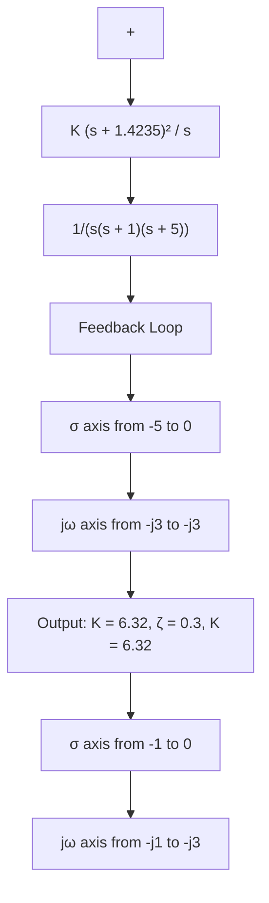

It is instructive to note that, for the case where the double zero is located at $s = - 1 . 4 2 3 5$ , increasing the value of $K _ { p }$ increases the speed of response, but as far as the percentage maximum overshoot is concerned, varying gain $K _ { p }$ has very little effect. The reason for this may be seen from the root-locus analysis. Figure 8–11 shows the root-locus diagram for the system designed by use of the second method of Ziegler–Nichols tuning rules. Since the dominant branches of root loci are along the $\zeta = 0 . 3$ lines for a considerable range of K, varying the value of K (from 6 to 30) will not change the damping ratio of the dominant closed-loop poles very much. However, varying the location of the double zero has a significant effect on the maximum overshoot, because the damping ratio of the dominant closed-loop poles can be changed significantly.This can also be seen from the root-locus analysis. Figure 8–12 shows the root-locus diagram for the system where the PID controller has the double zero at $s = - 0 . 6 5$ . Notice the change of the root-locus configuration.This change in the configuration makes it possible to change the damping ratio of the dominant closed-loop poles.

Figure 8–10 Unit-step response of the system shown in Figure 8–6 with PID controller having parameters $K _ { p } = 3 9 . 4 2 ,$ andT = 3.077, $T _ { d } = 0 . 7 6 9 2 .$   

line

| Time (sec) | Amplitude |
| --- | --- |
| 0.0 | 0.0 |
| 0.5 | 1.25 |
| 1.0 | 1.0 |
| 1.5 | 1.0 |
| 2.0 | 1.05 |
| 2.5 | 1.02 |
| 3.0 | 1.01 |
| 3.5 | 1.0 |
| 4.0 | 1.0 |
| 4.5 | 1.0 |
| 5.0 | 1.0 |

flowchart

Figure 8–11 Root-locus diagram of system when PID controller has double zero at s=–1.4235.
