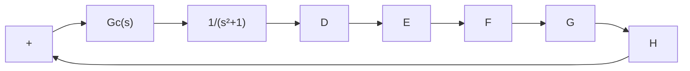

# 8–3 DESIGN OF PID CONTROLLERS WITH FREQUENCY-RESPONSE APPROACH

In this section we present a design of a PID controller based on the frequency-response approach.

Consider the system shown in Figure 8–13. Using a frequency-response approach, design a PID controller such that the static velocity error constant is 4 sec−1 , phase margin is 50° or more, and gain margin is 10 dB or more. Obtain the unit-step and unit-ramp response curves of the PID controlled system with MATLAB.

Let us choose the PID controller to be

$$G _ {c} (s) = \frac {K (a s + 1) (b s + 1)}{s}$$

Figure 8–13   
Control system.   

flowchart

Since the static velocity error constant $K _ { v }$ is specified as $\mathsf { I } \mathsf { s e c } ^ { - 1 }$ , we have

$$
\begin{array}{l} K _ {v} = \lim _ {s \rightarrow 0} s G _ {c} (s) \frac {1}{s ^ {2} + 1} = \lim _ {s \rightarrow 0} s \frac {K (a s + 1) (b s + 1)}{s} \frac {1}{s ^ {2} + 1} \\ = K = 4 \\ \end{array}
$$

Thus

$$G _ {c} (s) = \frac {4 (a s + 1) (b s + 1)}{s}$$

Next, we plot a Bode diagram of

$$G (s) = \frac {4}{s \left(s ^ {2} + 1\right)}$$

MATLAB Program 8–2 produces a Bode diagram of G(s).The resulting Bode diagram is shown in Figure 8–14.

<table><tr><td>MATLAB Program 8-2</td></tr><tr><td>num = [4];den = [1 0.00000000001 1 0];w = logspace(-1,1,200);bode(num,den,w)title(&#x27;Bode Diagram of 4/[s(s^2+1)]&#x27;)</td></tr></table>

line

| Frequency (rad/sec) | Phase (deg) | Magnitude (dB) |
| --- | --- | --- |
| 0.1 | ~30 | ~30 |
| 1.0 | ~50 | ~50 |
| 10.0 | ~-40 | ~-40 |

Figure 8–14   
Bode diagram of

$$4 / \left[ s \left(s ^ {2} + 1\right) \right].$$

We need the phase margin of at least $5 0 ^ { \circ }$ and gain margin of 10 dB or more. From the Bode diagram of Figure 8–14, we notice that the gain crossover frequency is approximately $\omega = 1 . 8$ radsec. Let us assume the gain crossover frequency of the compensated system to be somewhere between $\omega = 1$ and v=10 radsec. Noting that

$$G _ {c} (s) = \frac {4 (a s + 1) (b s + 1)}{s}$$
