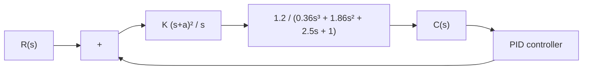

To solve this problem it is possible to write many different MATLAB programs.We present here one such program, MATLAB Program 8–6. In this program, notice that we use two “for” loops.We start the program with the outer loop to vary the $^ { 6 6 }$ values. Then we vary the $" a "$ values in the inner loop. We proceed by writing the MATLAB program such that the nested loops in the program begin with the lowest values of $^ { \cdot \circ } K ^ { \prime \prime }$ and $" a "$ and step toward the highest. Note that, depending on the system and the ranges of search for $^ { 6 6 }$ and $" a "$ and the step sizes chosen, it may take from several seconds to a few minutes for MATLAB to compute the desired sets of the values.

In this program the statement

$$\text { solution } (k,:) = [ K (i) a (j) m ]$$

will produce a table of K, a, m values. (In the present system there are 15 sets of K and a that will exhibit $m < 1 . 1 0 $ —that is, the maximum overshoot is less than 10%.)

Figure 8–19 PID-controlled system.   


<details>
<summary>flowchart</summary>


</details>

To sort out the solution sets in the order of the magnitude of the maximum overshoot (starting from the smallest value of m and ending at the largest value of m in the table), we use the command

$$\text { sortsolution } = \text { sortrows (solution,3) }$$

MATLAB Program 8–6   
```matlab
%'K' and 'a' values to test
K = [2.0 2.2 2.4 2.6 2.8 3.0];
a = [0.5 0.7 0.9 1.1 1.3 1.5];

% Evaluate closed-loop unit-step response at each 'K' and 'a' combination
% that will yield the maximum overshoot less than 10%

t = 0:0.01:5;
g = tf([1.2], [0.36 1.86 2.5 1]);
k = 0;
for i = 1:6;
    for j = 1:6;
    gc = tf(K(i)*[1 2*a(j) a(j)^2], [1 0]); % controller
    G = gc*g/(1 + gc*g); % closed-loop transfer function
    y = step(G,t);
    m = max(y);
    if m < 1.10
    k = k+1;
    solution(k,:) = [K(i) a(j) m];
    end
    end
end

solution % Print solution table

solution =
    2.0000 0.5000 0.9002
    2.0000 0.7000 0.9807
    2.0000 0.9000 1.0614
    2.2000 0.5000 0.9114
    2.2000 0.7000 0.9837
    2.2000 0.9000 1.0772
    2.4000 0.5000 0.9207
    2.4000 0.7000 0.9859
    2.4000 0.9000 1.0923
    2.6000 0.5000 0.9283
    2.6000 0.7000 0.9877
    2.8000 0.5000 0.9348
    2.8000 0.7000 1.0024
    3.0000 0.5000 0.9402
    3.0000 0.7000 1.0177
