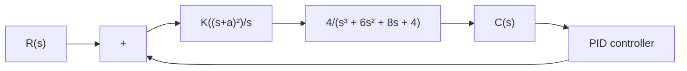

# EXAMPLE 8–3

Consider the system shown in Figure 8–23. We want to find all combinations of K and a values such that the closed-loop system has a maximum overshoot of less than 15%, but more than 10%, in the unit-step response. In addition, the settling time should be less than 3 sec. In this problem, assume that the search region is

$$3 \leq K \leq 5 \quad \text { and } \quad 0. 1 \leq a \leq 3$$

Determine the best choice of the parameters K and a.

Figure 8–23 PID-controlled system with a simplified PID controller.   


<details>
<summary>flowchart</summary>


</details>

In this problem, we choose the step sizes to be reasonable, — say 0.2 for K and 0.1 for a. MATLAB Program 8–7 gives the solution to this problem. From the sortsolution table, it looks like the first row is a good choice.Figure 8–24 shows the unit step response curve for K = 3.2 and a = 0.9.Since this choice requires a smaller K value than most other choices, we may decide that the first row is the best choice.

MATLAB Program 8–7   
```matlab
t = 0:0.01:8;
k = 0;
for K = 3:0.2:5;
    for a = 0.1:0.1:3;
    num = [4*K 8*K*a 4*K*a^2];
    den = [1 6 8+4*K 4+8*K*a 4*K*a^2];
    y = step(num,den,t);
    s = 801;while y(s)>0.98 & y(s)<1.02;s = s - 1;end;
    ts = (s-1)*0.01;% ts = settling time;
    m = max(y);
    if m<1.15 & m>1.10;if ts<3.00;
    k = k+1;
    solution(k,:) = [K a m ts];
    end
    end
    end
    end
    solution
solution =
    3.0000 1.0000 1.1469 2.7700
    3.2000 0.9000 1.1065 2.8300
    3.4000 0.9000 1.1181 2.7000
    3.6000 0.9000 1.1291 2.5800
    3.8000 0.9000 1.1396 2.4700
    4.0000 0.9000 1.1497 2.3800
    4.2000 0.8000 1.1107 2.8300
    4.4000 0.8000 1.1208 2.5900
    4.6000 0.8000 1.1304 2.4300
    4.8000 0.8000 1.1396 2.3100
    5.0000 0.8000 1.1485 2.2100

sortsolution = sortrows(solution,3)
sortsolution =
    3.2000 0.9000 1.1065 2.8300
    4.2000 0.8000 1.1107 2.8300
    3.4000 0.9000 1.1181 2.7000
    4.4000 0.8000 1.1208 2.5900
    3.6000 0.9000 1.1291 2.5800
    4.6000 0.8000 1.1304 2.4300
    4.8000 0.8000 1.1396 2.3100
    3.8000 0.9000 1.1396 2.470 
```

(continues on next page)
