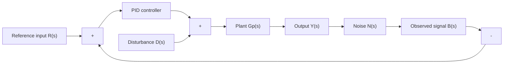
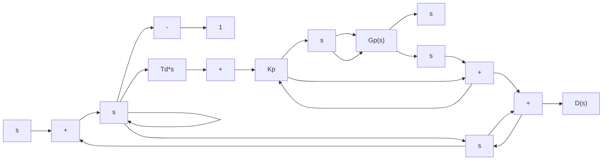
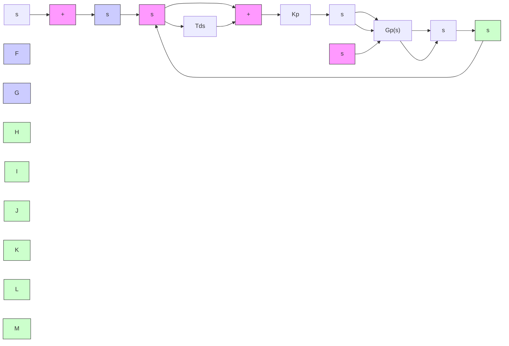

flowchart

Figure 8–25

(a) PID-controlled system;

(b) equivalent block diagram.

Figure 8–26 PI-D-controlled system.   

flowchart

Notice that in the absence of the disturbances and noises, the closed-loop transfer function of the basic PID control system [shown in Figure 8–25(b)] and the PI-D control system (shown in Figure 8–26) are given, respectively, by

$$\frac {Y (s)}{R (s)} = \left(1 + \frac {1}{T _ {i} s} + T _ {d} s\right) \frac {K _ {p} G _ {p} (s)}{1 + \left(1 + \frac {1}{T _ {i} s} + T _ {d} s\right) K _ {p} G _ {p} (s)}$$

and

$$\frac {Y (s)}{R (s)} = \left(1 + \frac {1}{T _ {i} s}\right) \frac {K _ {p} G _ {p} (s)}{1 + \left(1 + \frac {1}{T _ {i} s} + T _ {d} s\right) K _ {p} G _ {p} (s)}$$

It is important to point out that in the absence of the reference input and noises, the closed-loop transfer function between the disturbance D(s) and the output Y(s) in either case is the same and is given by
