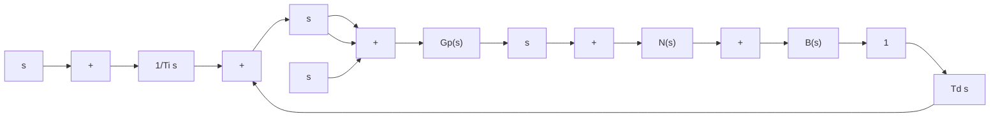

$$\frac {Y (s)}{D (s)} = \frac {G _ {p} (s)}{1 + K _ {p} G _ {p} (s) \left(1 + \frac {1}{T _ {i} s} + T _ {d} s\right)}$$

I-PD Control. Consider the case where the reference input is a step function. Both PID control and PI-D control involve a step function in the manipulated signal. Such a step change in the manipulated signal may not be desirable in many occasions. Therefore, it may be advantageous to move the proportional action and derivative action to the feedback path so that these actions affect the feedback signal only. Figure 8–27 shows such a control scheme. It is called the I-PD control. The manipulated signal is given by

$$U (s) = K _ {p} \frac {1}{T _ {i} s} R (s) - K _ {p} \left(1 + \frac {1}{T _ {i} s} + T _ {d} s\right) B (s)$$

Notice that the reference input R(s) appears only in the integral control part. Thus, in I-PD control, it is imperative to have the integral control action for proper operation of the control system.

Figure 8–27 I-PD-controlled system.   

flowchart

The closed-loop transfer function $Y ( s ) / R ( s )$ in the absence of the disturbance input and noise input is given by

$$\frac {Y (s)}{R (s)} = \left(\frac {1}{T _ {i} s}\right) \frac {K _ {p} G _ {p} (s)}{1 + K _ {p} G _ {p} (s) \left(1 + \frac {1}{T _ {i} s} + T _ {d} s\right)}$$

It is noted that in the absence of the reference input and noise signals, the closed-loop transfer function between the disturbance input and the output is given by

$$\frac {Y (s)}{D (s)} = \frac {G _ {p} (s)}{1 + K _ {p} G _ {p} (s) \left(1 + \frac {1}{T _ {i} s} + T _ {d} s\right)}$$

This expression is the same as that for PID control or PI-D control.
