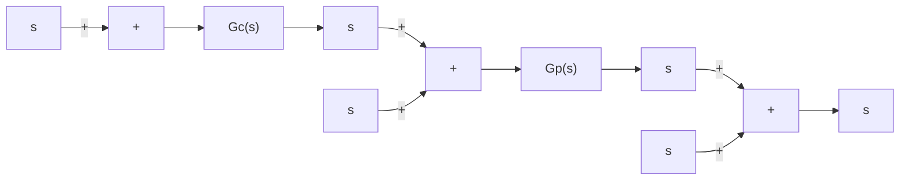

# 8–6 TWO-DEGREES-OF-FREEDOM CONTROL

Consider the system shown in Figure 8–28, where the system is subjected to the disturbance input $D ( s )$ and noise input $N ( s )$ , in addition to the reference input $R ( s )$ . $G _ { c } ( s )$ is the transfer function of the controller and $G _ { p } ( s )$ is the transfer function of the plant. We assume that $G _ { p } ( s )$ is fixed and unalterable.

Figure 8–28

One-degree-offreedom control system.

flowchart

For this system, three closed-loop transfer functions $Y ( s ) / R ( s ) = G _ { y r }$ , $Y ( s ) / D ( s ) = G _ { y d }$ , and $Y ( s ) / N ( s ) = G _ { y n }$ may be derived. They are

$$G _ {y r} = \frac {Y (s)}{R (s)} = \frac {G _ {c} G _ {p}}{1 + G _ {c} G _ {p}}G _ {y d} = \frac {Y (s)}{D (s)} = \frac {G _ {p}}{1 + G _ {c} G _ {p}}G _ {y n} = \frac {Y (s)}{N (s)} = - \frac {G _ {c} G _ {p}}{1 + G _ {c} G _ {p}}$$

[In deriving $Y ( s ) / R ( s )$ , we assumed $D ( s ) = 0$ and $N ( s ) = 0$ . Similar comments apply to the derivations of $Y ( s ) / D ( s )$ and $Y ( s ) / N ( s ) . ]$ The degrees of freedom of the control system refers to how many of these closed-loop transfer functions are independent. In the present case, we have

$$G _ {y r} = \frac {G _ {p} - G _ {y d}}{G _ {p}}G _ {y n} = \frac {G _ {y d} - G _ {p}}{G _ {p}}$$

Among the three closed-loop transfer functions $G _ { y r } , G _ { y n }$ , and $G _ { \nu d } ,$ , if one of them is given, the remaining two are fixed. This means that the system shown in Figure 8–28 is a one-degree-of-freedom control system.

Next consider the system shown in Figure 8–29, where $G _ { p } ( s )$ is the transfer function of the plant. For this system, closed-loop transfer functions $G _ { y r } , G _ { y n }$ , and $G _ { y d }$ are given, respectively, by

$$G _ {y r} = \frac {Y (s)}{R (s)} = \frac {G _ {c 1} G _ {p}}{1 + \left(G _ {c 1} + G _ {c 2}\right) G _ {p}}G _ {y d} = \frac {Y (s)}{D (s)} = \frac {G _ {p}}{1 + \left(G _ {c 1} + G _ {c 2}\right) G _ {p}}G _ {y n} = \frac {Y (s)}{N (s)} = - \frac {\left(G _ {c 1} + G _ {c 2}\right) G _ {p}}{1 + \left(G _ {c 1} + G _ {c 2}\right) G _ {p}}$$

Figure 8–29

Two-degrees-offreedom control system.

