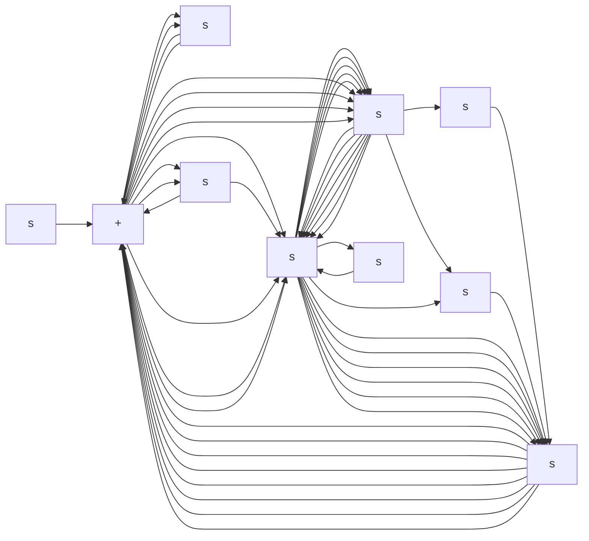
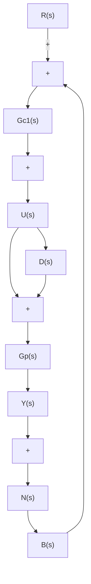

flowchart

Hence, we have

$$G _ {y r} = G _ {c 1} G _ {y d}G _ {y n} = \frac {G _ {y d} - G _ {p}}{G _ {p}}$$

In this case, if $G _ { y d }$ is given, then $G _ { y n }$ is fixed, but $G _ { y r }$ is not fixed, because $G _ { c 1 }$ is independent of $G _ { \nu d }$ . Thus, two closed-loop transfer functions among three closed-loop transfer functions $\dot { G } _ { y r } , G _ { y d }$ , and $G _ { y n }$ are independent. Hence, this system is a two-degreesof-freedom control system.

Similarly, the system shown in Figure 8–30 is also a two-degrees-of-freedom control system, because for this system

$$G _ {y r} = \frac {Y (s)}{R (s)} = \frac {G _ {c 1} G _ {p}}{1 + G _ {c 1} G _ {p}} + \frac {G _ {c 2} G _ {p}}{1 + G _ {c 1} G _ {p}}G _ {y d} = \frac {Y (s)}{D (s)} = \frac {G _ {p}}{1 + G _ {c 1} G _ {p}}G _ {y n} = \frac {Y (s)}{N (s)} = - \frac {G _ {c 1} G _ {p}}{1 + G _ {c 1} G _ {p}}$$

flowchart

Figure 8–30   
Two-degrees-offreedom control system.

Hence,

$$G _ {y r} = G _ {c 2} G _ {y d} + \frac {G _ {p} - G _ {y d}}{G _ {p}}G _ {y n} = \frac {G _ {y d} - G _ {p}}{G _ {p}}$$

Clearly, if $G _ { y d }$ is given, then $G _ { y n }$ is fixed, but $G _ { y r }$ is not fixed, because $G _ { c 2 }$ is independent of $G _ { y d }$ .

It will be seen in Section 8–7 that, in such a two-degrees-of-freedom control system, both the closed-loop characteristics and the feedback characteristics can be adjusted independently to improve the system response performance.
