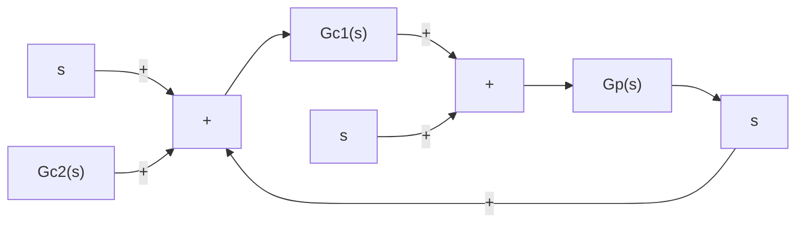

# 8–7 ZERO-PLACEMENT APPROACH TO IMPROVE RESPONSE CHARACTERISTICS

We shall show here that by use of the zero-placement approach presented later in this section, we can achieve the following:

The responses to the ramp reference input and acceleration reference input exhibit no steady-state errors.

In high-performance control systems it is always desired that the system output follow the changing input with minimum error. For step, ramp, and acceleration inputs, it is desired that the system output exhibit no steady-state error.

In what follows, we shall demonstrate how to design control systems that will exhibit no steady-state errors in following ramp and acceleration inputs and at the same time force the response to the step disturbance input to approach zero quickly.

Consider the two-degrees-of-freedom control system shown in Figure 8–31. Assume that the plant transfer function $G _ { p } ( s )$ is a minimum-phase transfer function and is given by

$$G _ {p} (s) = K \frac {A (s)}{B (s)}$$

flowchart

Figure 8–31   
Two-degrees-offreedom control system.

where

$$A (s) = \bigl (s + z _ {1} \bigr) \bigl (s + z _ {2} \bigr) \dots \bigl (s + z _ {m} \bigr)B (s) = s ^ {N} \left(s + p _ {N + 1}\right) \left(s + p _ {N + 2}\right) \dots \left(s + p _ {n}\right)$$

where N may be 0, 1, 2 and $n \geq m$ . Assume also that $G _ { c 1 }$ is a PID controller followed by a filter $1 / A ( s )$ , or

$$G _ {c 1} (s) = \frac {\alpha_ {1} s + \beta_ {1} + \gamma_ {1} s ^ {2}}{s} \frac {1}{A (s)}$$

and $G _ { c 2 }$ is a PID, PI, PD, I, D, or P controller followed by a filter $1 / A ( s )$ . That is

$$G _ {c 2} (s) = \frac {\alpha_ {2} s + \beta_ {2} + \gamma_ {2} s ^ {2}}{s} \frac {1}{A (s)}$$

where some of $\alpha _ { 2 } , \beta _ { 2 }$ , and $\gamma _ { 2 }$ may be zero. Then it is possible to write $G _ { c 1 } + G _ { c 2 }$ as

$$G _ {c 1} + G _ {c 2} = \frac {\alpha s + \beta + \gamma s ^ {2}}{s} \frac {1}{A (s)} \tag {8-3}$$

where $\alpha , \beta ,$ and g are constants. Then
