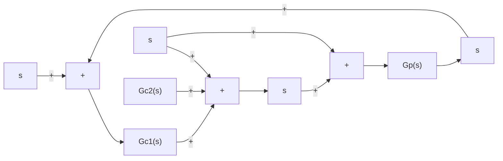

# EXAMPLE 8–4

Consider the two-degrees-of-freedom control system shown in Figure 8–33. The plant transfer function $G _ { p } ( s )$ is given by

$$G _ {p} (s) = \frac {1 0}{s (s + 1)}$$

Design controllers $G _ { c 1 } ( s )$ and $G _ { c 2 } ( s )$ such that the maximum overshoot in the response to the unit-step reference input be less than 19%, but more than 2%, and the settling time be less than 1 sec. It is desired that the steady-state errors in following the ramp reference input and acceleration reference input be zero.The response to the unit-step disturbance input should have a small amplitude and settle to zero quickly.

To design suitable controllers $G _ { c 1 } ( s )$ and $G _ { c 2 } ( s )$ first note that,

$$\frac {Y (s)}{D (s)} = \frac {G _ {p}}{1 + G _ {p} \left(G _ {c 1} + G _ {c 2}\right)}$$

To simplify the notation, let us define

$$G _ {c} = G _ {c 1} + G _ {c 2}$$

Then

$$\frac {Y (s)}{D (s)} = \frac {G _ {p}}{1 + G _ {p} G _ {c}} = \frac {\frac {1 0}{s (s + 1)}}{1 + \frac {1 0}{s (s + 1)} G _ {c}}= \frac {1 0}{s (s + 1) + 1 0 G _ {c}}$$

flowchart

Figure 8–33 Two-degreesof-freedom control system.

Second, note that

$$\frac {Y (s)}{R (s)} = \frac {G _ {p} G _ {c 1}}{1 + G _ {p} G _ {c}} = \frac {1 0 G _ {c 1}}{s (s + 1) + 1 0 G _ {c}}$$

Notice that the characteristic equation for $Y ( s ) / D ( s )$ and the one for $Y ( s ) / R ( s )$ are identical.

We may be tempted to choose a zero of $G _ { c } ( s )$ at $s = - 1$ to cancel a pole at $s = - 1$ of the plant $G _ { p } ( s )$ However, the canceled pole. $s = - 1$ becomes a closed-loop pole of the entire system, as seen below. If we define $G _ { c } ( s )$ as a PID controller such that

$$G _ {c} (s) = \frac {K (s + 1) (s + \beta)}{s} \tag {8-7}$$

then

$$\frac {Y (s)}{D (s)} = \frac {1 0}{s (s + 1) + \frac {1 0 K (s + 1) (s + \beta)}{s}}= \frac {1 0 s}{(s + 1) [ s ^ {2} + 1 0 K (s + \beta) ]}$$

The closed-loop pole at $s = - 1$ is a slow-response pole, and if this closed-loop pole is included in the system, the settling time will not be less than 1 sec. Therefore, we should not choose $G _ { c } ( s )$ as given by Equation (8–7).

The design of controllers $G _ { c 1 } ( s )$ and $G _ { c 2 } ( s )$ consists of two steps.
