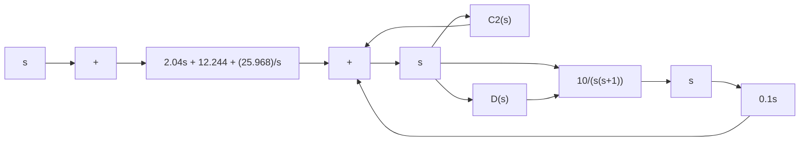

Since the numerator involves ${ } ^ { \left. } s { } ^ { \right. } , G _ { c 1 } ( s )$ must include an integrator to cancel this $" s >$ . [Although we want “s” in the numerator of the closed-loop transfer function $Y ( s ) / D ( s )$ to obtain zero steady-state error to the step disturbance input, we do not want to have $" s \ "$ in the numerator of the closed-loop transfer function $Y ( s ) / R ( s ) . ]$ To eliminate the offset in the response to the step reference input and eliminate the steady-state errors in following the ramp reference input and acceleration reference input, the numerator of $Y ( s ) / R ( s )$ must be equal to the last three terms of the denominator, as mentioned earlier. That is,

$$1 0 s G _ {c 1} (s) = 2 0. 4 s ^ {2} + 1 2 2. 4 4 s + 2 5 9. 6 8$$

or

$$G _ {c 1} (s) = 2. 0 4 s + 1 2. 2 4 4 + \frac {2 5 . 9 6 8}{s}$$

Thus, $G _ { c 1 } ( s )$ is a PID controller. Since $G _ { c } ( s )$ is given as

$$G _ {c} (s) = G _ {c 1} (s) + G _ {c 2} (s) = \frac {1 . 9 4 s ^ {2} + 1 2 . 2 4 4 s + 2 5 . 9 6 8}{s}$$

we obtain

$$
\begin{array}{l} G _ {c 2} (s) = G _ {c} (s) - G _ {c 1} (s) \\ = \left(1. 9 4 s + 1 2. 2 4 4 + \frac {2 5 . 9 6 8}{s}\right) - \left(2. 0 4 s + 1 2. 2 4 4 + \frac {2 5 . 9 6 8}{s}\right) \\ = - 0. 1 s \\ \end{array}
$$

Thus, $G _ { c 2 } ( s )$ is a derivative controller. A block diagram of the designed system is shown in Figure 8–37.

The closed-loop transfer function $Y ( s ) / R ( s )$ now becomes

$$\frac {Y (s)}{R (s)} = \frac {2 0 . 4 s ^ {2} + 1 2 2 . 4 4 s + 2 5 9 . 6 8}{s ^ {3} + 2 0 . 4 s ^ {2} + 1 2 2 . 4 4 s + 2 5 9 . 6 8}$$

Figure 8–37 Block diagram of the designed system.   

flowchart

Figure 8–38 (a) Response to unitramp reference input; (b) response to unit-acceleration reference input.   

line

| t (sec) | Unit-Ramp Input | Output |
| --- | --- | --- |
| 0.0 | 0.0 | 0.0 |
| 0.2 | 0.2 | 0.2 |
| 0.4 | 0.4 | 0.4 |
| 0.6 | 0.6 | 0.6 |
| 0.8 | 0.8 | 0.8 |
| 1.0 | 1.0 | 1.0 |
| 1.2 | 1.2 | 1.2 |
| 1.4 | 1.4 | 1.4 |
| 1.6 | 1.6 | 1.6 |
| 1.8 | 1.8 | 1.8 |
| 2.0 | 2.0 | 2.0 |

line

