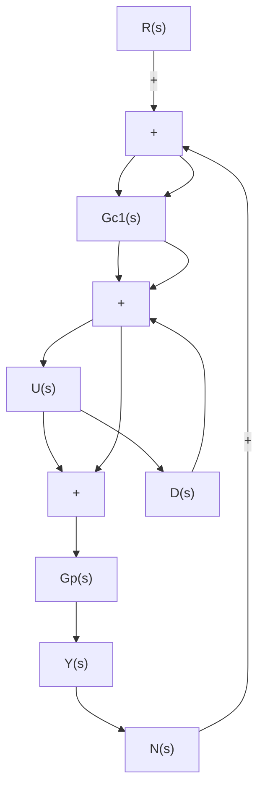

# EXAMPLE 8–5

Consider the control system shown in Figure 8–39. This is a two-degrees-of-freedom system. In the design problem considered here, we assume that the noise input $N ( s )$ is zero. Assume that the plant transfer function $G _ { p } ( s )$ is given by

$$G _ {p} (s) = \frac {5}{(s + 1) (s + 5)}$$

Figure 8–39 Two-degrees-offreedom control system.   

flowchart

Assume also that the controller $G _ { c 1 } ( s )$ is of PID type. That is,

$$G _ {c 1} (s) = K _ {p} \left(1 + \frac {1}{T _ {i} s} + T _ {d} s\right)$$

The controller $G _ { c 2 } ( s )$ is of P or PD type. $[ \mathrm { I f } ~ G _ { c 2 } ( s )$ involves integral control action, then this will introduce a ramp component in the input signal, which is not desirable. Therefore, $G _ { c 2 } ( s )$ should not include the integral control action.] Thus, we assume that

$$G _ {c 2} (s) = \hat {K} _ {p} \bigl (1 + \hat {T} _ {d} s \bigr)$$

where $\hat { T } _ { d }$ may be zero.

Let us design controllers $G _ { c 1 } ( s )$ and $G _ { c 2 } ( s )$ such that the responses to the step-disturbance input and the step-reference input are of “desirable characteristics” in the sense that

1. The response to the step-disturbance input will have a small peak and eventually approach zero. (That is, there will be no steady-state error.)   
2. The response to the step reference input will exhibit less than 25% overshoot with a settling time less than 2 sec.The steady-state errors to the ramp reference input and acceleration reference input should be zero.

The design of this two-degrees-of-freedom control system may be carried out by following the steps 1 and 2 below.

1. Determine $G _ { c 1 } ( s )$ so that the response to the step-disturbance input is of desirable characteristics.   
2. Design $G _ { c 2 } ( s )$ so that the responses to the reference inputs are of desirable characteristics without changing the response to the step disturbance considered in step 1.
