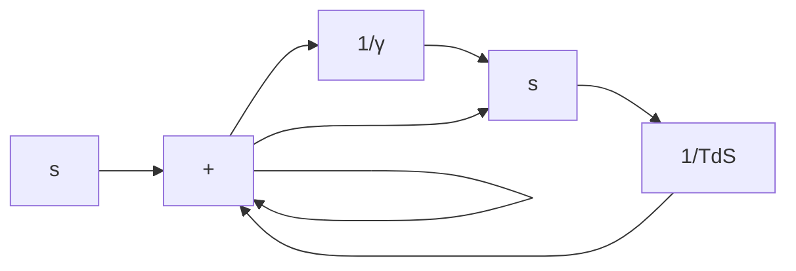

A–8–3. Consider the electronic circuit involving two operational amplifiers shown in Figure 8–45. This is a modified PID controller in that the transfer function involves an integrator and a first-order lag term. Obtain the transfer function of this PID controller.

Solution. Since

$$Z _ {1} = \frac {1}{\frac {1}{R _ {1}} + C _ {1} s} + R _ {3} = \frac {R _ {1} + R _ {3} + R _ {1} R _ {3} C _ {1} s}{1 + R _ {1} C _ {1} s}$$

and

$$Z _ {2} = R _ {2} + \frac {1}{C _ {2} s}$$

we have

$$\frac {E (s)}{E _ {i} (s)} = - \frac {Z _ {2}}{Z _ {1}} = - \frac {\left(R _ {2} C _ {2} s + 1\right) \left(R _ {1} C _ {1} s + 1\right)}{C _ {2} s \left(R _ {1} + R _ {3} + R _ {1} R _ {3} C _ {1} s\right)}\frac {E _ {o} (s)}{E (s)} = - \frac {R _ {5}}{R _ {4}}$$

Figure 8–45 Modified PID controller.   

text_image

Z1
C1
R1
R3
Z2
R2
C2
Ei(s)
+
-
R4
-
+
E(s)
R5
Eo(s)

Figure 8–46 Approximate differentiator.   

flowchart

Consequently,

$$
\begin{array}{l} \frac {E _ {o} (s)}{E _ {i} (s)} = \frac {E _ {o} (s)}{E (s)} \frac {E (s)}{E _ {i} (s)} = \frac {R _ {5}}{R _ {4} \left(R _ {1} + R _ {3}\right) C _ {2}} \frac {\left(R _ {1} C _ {1} s + 1\right) \left(R _ {2} C _ {2} s + 1\right)}{s \left(\frac {R _ {1} R _ {3}}{R _ {1} + R _ {3}} C _ {1} s + 1\right)} \\ = \frac {R _ {5} R _ {2}}{R _ {4} R _ {3}} \frac {\left(s + \frac {1}{R _ {1} C _ {1}}\right) \left(s + \frac {1}{R _ {2} C _ {2}}\right)}{s \left(s + \frac {R _ {1} + R _ {3}}{R _ {1} R _ {3} C _ {1}}\right)} \\ \end{array}
$$

Notice that $R _ { 1 } C _ { 1 }$ and $R _ { 2 } C _ { 2 }$ determine the locations of the zeros of the controller, while $R _ { 1 } , R _ { 3 } { \mathrm { ; } }$ , and $C _ { 1 }$ affect the location of the pole on the negative real axis. $R _ { 5 } / R _ { 4 }$ adjusts the gain of the controller.

A–8–4. In practice, it is impossible to realize the true differentiator. Hence, we always have to approximate the true differentiator $T _ { d } s$ by something like

$$\frac {T _ {d} s}{1 + \gamma T _ {d} s}$$
