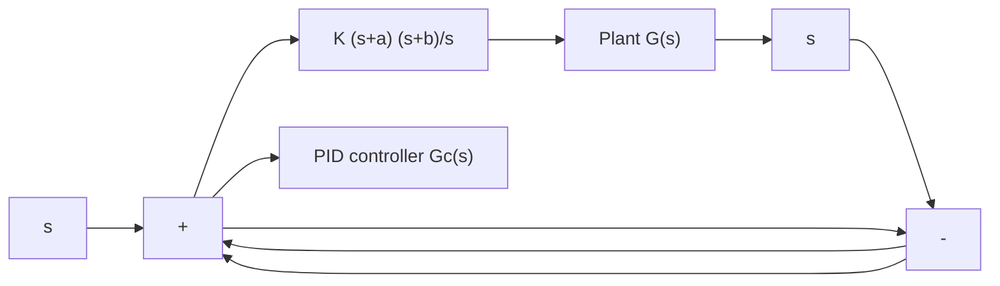

$$
\begin{array}{l} \frac {C _ {r} (s)}{R (s)} = \frac {1 0 . 4 \left(s ^ {2} + 4 . 5 1 9 2 s + 1 5 . 3 8 5\right)}{s ^ {3} + 1 4 s ^ {2} + 5 6 s + 1 6 0} \\ = \frac {1 0 . 4 s ^ {2} + 4 7 s + 1 6 0}{s ^ {3} + 1 4 s ^ {2} + 5 6 s + 1 6 0} \\ \end{array}
$$

The response to a unit-step reference input can also be obtained by use of MATLAB Program 8–9. The resulting response curve is shown in Figure 8–48(b).The response curve shows that the maximum overshoot is 7.3% and the settling time is 1.2 sec.The system has quite acceptable response characteristics.

line

| t Sec | Output to Disturbance Input (×10⁻³) |
| --- | --- |
| 0.0 | 0.0 |
| 0.5 | 12.5 |
| 1.0 | 0.0 |
| 1.5 | -2.0 |
| 2.0 | 0.0 |
| 2.5 | 0.0 |
| 3.0 | 0.0 |
| 3.5 | 0.0 |
| 4.0 | 0.0 |
| 4.5 | 0.0 |
| 5.0 | 0.0 |

line

| t Sec | Output to Reference Input |
| --- | --- |
| 0.0 | 0.0 |
| 0.5 | 1.05 |
| 1.0 | 0.98 |
| 1.5 | 0.97 |
| 2.0 | 1.00 |
| 2.5 | 1.00 |
| 3.0 | 1.00 |
| 3.5 | 1.00 |
| 4.0 | 1.00 |
| 4.5 | 1.00 |
| 5.0 | 1.00 |

Figure 8–48 (a) Response to unit-step disturbance input; (b) response to unit-step reference input.

A–8–6. Consider the system shown in Figure 8–49. It is desired to design a PID controller $G _ { c } ( s )$ such that the dominant closed-loop poles are located at $s = - 1 \pm j \sqrt { 3 }$ For the PID controller,. choose $a = 1$ and then determine the values of K and b. Sketch the root-locus diagram for the designed system.

Solution. Since

$$G _ {c} (s) G (s) = K \frac {(s + 1) (s + b)}{s} \frac {1}{s ^ {2} + 1}$$

Figure 8–49 PID-controlled system.   

flowchart

the sum of the angles at $s = - 1 + j \sqrt { 3 }$ one of the desired closed-loop poles, from the zero at, $s = - 1$ and poles at s=0, s=j, and $s = - j$ is

$$9 0 ^ {\circ} - 1 4 3. 7 9 4 ^ {\circ} - 1 2 0 ^ {\circ} - 1 1 0. 1 0 4 ^ {\circ} = - 2 8 3. 8 9 8 ^ {\circ}$$

Hence the zero at $s = - b$ must contribute $1 0 3 . 8 9 8 ^ { \circ }$ . This requires that the zero be located at

$$b = 0. 5 7 1 4$$

The gain constant K can be determined from the magnitude condition.
