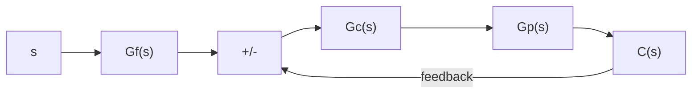
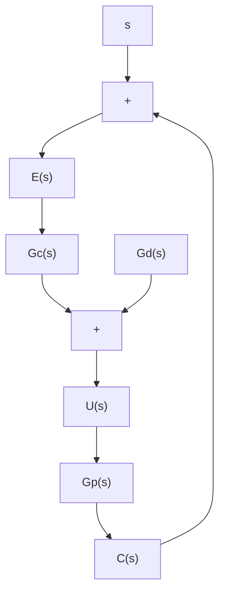

By substituting $G _ { d } ( s ) = \big [ G _ { f } ( s ) - 1 \big ] G _ { c } ( s )$ into Equation (8–16), we obtain

$$\frac {C (s)}{R (s)} = \frac {\left[ G _ {f} (s) G _ {c} (s) - G _ {c} (s) + G _ {c} (s) \right] G _ {p} (s)}{1 + G _ {c} (s) G _ {p} (s)}= G _ {f} (s) \frac {G _ {c} (s) G _ {p} (s)}{1 + G _ {c} (s) G _ {p} (s)}$$

flowchart

flowchart

Figure 8–61 (a) Block diagram of control system with input filter; (b) modified block diagram.

which is the same as Equation (8–15). Hence, we have shown that the systems shown in Figures 8–61(a) and (b) are equivalent.

It is noted that the system shown in Figure $8 \mathrm { - } 6 1 ( \mathrm { b } )$ has a feedforward controller $G _ { d } ( s )$ I n. such a case, $G _ { d } ( s )$ does not affect the stability of the closed-loop portion of the system.

A–8–11. A closed-loop system has the characteristic that the closed-loop transfer function is nearly equal to the inverse of the feedback transfer function whenever the open-loop gain is much greater than unity.

The open-loop characteristic may be modified by adding an internal feedback loop with a characteristic equal to the inverse of the desired open-loop characteristic. Suppose that a unity-feedback system has the open-loop transfer function

$$G (s) = \frac {K}{(T _ {1} s + 1) (T _ {2} s + 1)}$$

Determine the transfer function $H ( s )$ of the element in the internal feedback loop so that the inner loop becomes ineffective at both low and high frequencies.

Solution. Figure $8 \mathrm { - } 6 2 ( \mathrm { a } )$ shows the original system. Figure 8–62(b) shows the addition of the internal feedback loop around $G ( s )$ . Since

$$\frac {C (s)}{E (s)} = \frac {G (s)}{1 + G (s) H (s)} = \frac {1}{H (s)} \frac {G (s) H (s)}{1 + G (s) H (s)}$$
