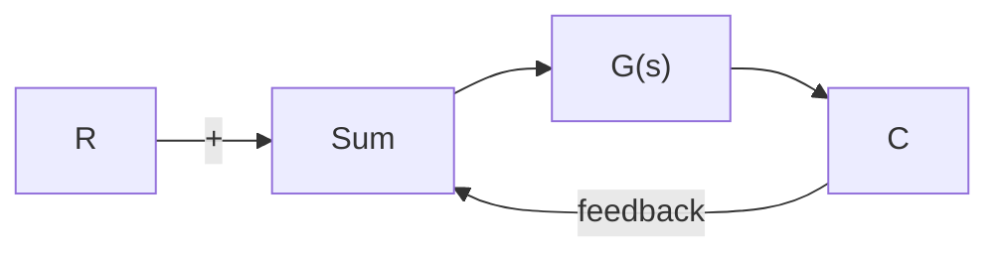

if the gain around the inner loop is large compared with unity, then $G ( s ) H ( s ) / \bigl [ 1 + G ( s ) H ( s ) \bigr ]$ isD approximately equal to unity, and the transfer function $C ( s ) / E ( s )$ is approximately equal to $1 / H ( s )$

On the other hand, if the gain $\vert G ( s ) H ( s ) \vert$ is much less than unity, the inner loop becomes ineffective and $C ( s ) / E ( s )$ becomes approximately equal to $G ( s )$ .

To make the inner loop ineffective at both the low- and high-frequency ranges, we require that

$$| G (j \omega) H (j \omega) | \ll 1, \text { for } \omega \ll 1 \text { and } \omega \gg 1$$

Since, in this problem,

$$G (j \omega) = \frac {K}{(1 + j \omega T _ {1}) (1 + j \omega T _ {2})}$$


<details>
<summary>flowchart</summary>


</details>

Figure 8–62 (a) Control system; (b) addition of the internal feedback loop to modify the closed-loop characteristic.   


<details>
<summary>flowchart</summary>

```mermaid
graph LR
    R --> A["+"] --> E --> G["s"] --> C --> = --> R --> B["+"] --> E --> 1/H["s"] --> G["s"] --> C
    A --> C
    B --> C
    E --> C
    G["s"] --> C
    H["s"] --> C
```
</details>

(b)

the requirement can be satisfied if H(s) is chosen to be

$$H (s) = k s$$

because

$$\lim _ {\omega \rightarrow 0} G (j \omega) H (j \omega) = \lim _ {\omega \rightarrow 0} \frac {K k j \omega}{(1 + j \omega T _ {1}) (1 + j \omega T _ {2})} = 0\lim _ {\omega \rightarrow \infty} G (j \omega) H (j \omega) = \lim _ {\omega \rightarrow \infty} \frac {K k j \omega}{(1 + j \omega T _ {1}) (1 + j \omega T _ {2})} = 0$$

Thus, with $H ( s ) = k s$ (velocity feedback), the inner loop becomes ineffective at both the lowand high-frequency regions. It becomes effective only in the intermediate-frequency region.

A–8–12. Consider the control system shown in Figure 8–63. This is the same system as that considered in Example 8–1. In that example we designed a PID controller $G _ { c } ( s )$ , starting with the second method of the Ziegler–Nichols tuning rule. Here we design a PID controller using the computational approach with MATLAB. We shall determine the values of K and a of the PID controller

$$G _ {c} (s) = K \frac {(s + a) ^ {2}}{s}$$
