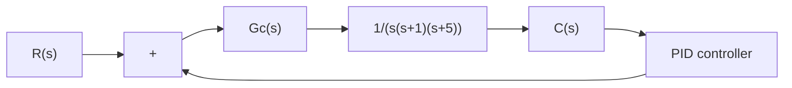

such that the unit-step response will exhibit the maximum overshoot between 10% and 2% (1.02 - maximum output - 1.10) and the settling time will be less than 3 sec. The search region is

$$2 \leq K \leq 5 0, \quad 0. 0 5 \leq a \leq 2$$

Let us choose the step size for K to be 1 and that for a to be 0.05.

Write a MATLAB program to find the first set of variables K and a that will satisfy the given specifications. Also, write a MATLAB program to find all possible sets of variables K and a that will satisfy the given specifications. Plot the unit-step response curves of the designed system with the chosen sets of variables K and a.

Solution. The transfer function of the plant is

$$G _ {p} (s) = \frac {1}{s ^ {3} + 6 s ^ {2} + 5 s}$$

The closed-loop transfer function $C ( s ) / R ( s )$ is given by

$$\frac {C (s)}{R (s)} = \frac {K s ^ {2} + 2 K a s + K a ^ {2}}{s ^ {4} + 6 s ^ {3} + (5 + K) s ^ {2} + 2 K a s + K a ^ {2}}$$

A possible MATLAB program that will produce the first set of variables K and a that will satisfy the given specifications is given in MATLAB Program 8–15. In this program we use two ‘for’ loops. The specification for the settling time is interpreted by the following four lines:

flowchart

Figure 8–63 Control system.

$$
\begin{array}{l} s = 5 0 1; \text { while } y (s) > 0. 9 8 \text { and } y (s) <   1. 0 2; \\ s = s - 1; \text { end }; \\ \mathrm{ts} = (\mathrm{s} - 1) * 0. 0 1 \\ \mathrm{ts} <   3. 0 \\ \end{array}
$$

Note that for t=0 : 0.01 : 5, we have 501 computing time points. s=501 corresponds to the last computing time point.

The solution obtained by this program is

$$K = 3 2, \quad a = 0. 2$$

with the maximum overshoot equal to 9.69% and the settling time equal to 2.64 sec.The resulting unit-step response curve is shown in Figure 8–64.

MATLAB Program 8–15   
t = 0:0.01:5;
for K = 50:-1:2;
    for a = 2:-0.05:0.05;
    num = [K 2*K*a K*a^2];
    den = [1 6 5+K 2*K*a K*a^2];
    y = step(num,den,t);
    m = max(y);
    s = 501; while y(s) > 0.98 & y(s) < 1.02;
    s = s-1; end;
    ts = (s-1)*0.01;
    if m < 1.10 & m > 1.02 & ts < 3.0
    break;
    end
    end
    if m < 1.10 & m > 1.02 & ts < 3.0
    break
    end
    end
    plot(t,y)
grid
title('Unit-Step Response')
xlabel('t sec')
ylabel('Output')
solution = [K;a;m;ts]
solution =
32.0000
0.2000
1.0969
2.6400
