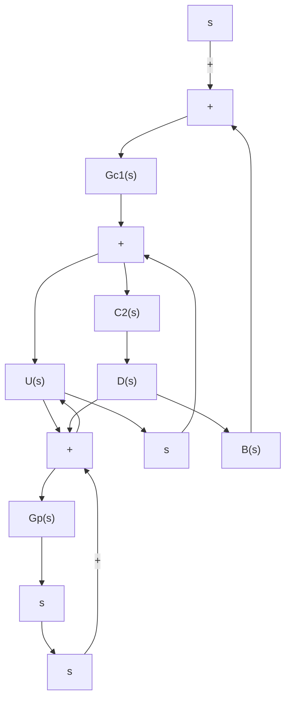

| t (sec) | K = 29, a = 0.25 | K = 27, a = 0.2 |
| --- | --- | --- |
| 0.0 | 0.0 | 0.0 |
| 0.5 | 1.1 | 1.0 |
| 1.0 | 1.0 | 0.9 |
| 1.5 | 0.95 | 0.95 |
| 2.0 | 0.98 | 0.98 |
| 2.5 | 0.99 | 0.99 |
| 3.0 | 1.0 | 1.0 |
| 3.5 | 1.0 | 1.0 |
| 4.0 | 1.0 | 1.0 |
| 4.5 | 1.0 | 1.0 |
| 5.0 | 1.0 | 1.0 |

From the sorttable, it seems that

$$K = 29, a = 0.25 (\text { max overshoot } = 9.52 \%, \text { settling time } = 1.78 \text { sec })$$

and

$$K = 27, a = 0.2 (\text { max overshoot } = 5.5\%, \text { settling time } = 2.89 \text { sec })$$

are two of the best choices.The unit-step response curves for these two cases are shown in Figure 8–65. From these curves, we might conclude that the best choice depends on the system objective. If a small maximum overshoot is desired, $K = 2 7 , a = 0 . 2$ will be the best choice. If the shorter settling time is more important than a small maximum overshoot, then K=29, a=0.25 will be the best choice.

A–8–13. Consider the two-degrees-of-freedom control system shown in Figure 8–66. The plant $G _ { p } ( s )$ i s given by

$$G _ {p} (s) = \frac {1 0 0}{s (s + 1)}$$

Assuming that the noise input $N ( s )$ is zero, design controllers $G _ { c 1 } ( s )$ and $G _ { c 2 } ( s )$ such that the designed system satisfies the following:

1. The response to the step disturbance input has a small amplitude and settles to zero quickly (on the order of 1 sec to 2 sec).

Figure 8–66

Two-degrees-offreedom control system.

flowchart

2. The response to the unit-step reference input has a maximum overshoot of 25% or less, and the settling time is 1 sec or less.   
3. The steady-state errors in following ramp reference input and acceleration reference input are zero.

Solution. The closed-loop transfer functions for the disturbance input and reference input are given, respectively, by

$$\frac {Y (s)}{D (s)} = \frac {G _ {p} (s)}{1 + G _ {c 1} (s) G _ {p} (s)}\frac {Y (s)}{R (s)} = \frac {\left[ G _ {c 1} (s) + G _ {c 2} (s) \right] G _ {p} (s)}{1 + G _ {c 1} (s) G _ {p} (s)}$$

Let us assume that $G _ { c 1 } ( s )$ is a PID controller and has the following form:

$$G _ {c 1} (s) = \frac {K (s + a) ^ {2}}{s}$$

The characteristic equation for the system is
