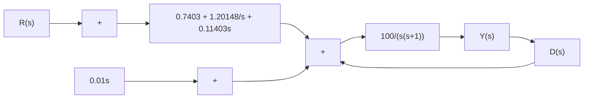

Figure 8–69 Block diagram of the designed system.   

flowchart

and from Equation (8–17)

$$G _ {c 1} (s) = 0. 7 4 0 3 + \frac {1 . 2 0 1 4 8}{s} + 0. 1 1 4 0 3 s$$

we obtain

$$
\begin{array}{l} G _ {c 2} (s) = \left(0. 7 4 0 3 + \frac {1 . 2 0 1 4 8}{s} + 0. 1 2 4 0 3 s\right) \\ - \left(0. 7 4 0 3 + \frac {1 . 2 0 1 4 8}{s} + 0. 1 1 4 0 3 s\right) \\ = 0. 0 1 s \tag {8-19} \\ \end{array}
$$

Equations (8–17) and (8–19) give the transfer functions of the controllers $G _ { c 1 } ( s )$ and $G _ { c 2 } ( s )$ re-), spectively. The block diagram of the designed system is shown in Figure $8 { - } 6 9$ .

Note that if the maximum overshoot were much higher than 25% and/or the settling time were much larger than 1.2 sec, then we might assume a search region (such as $3 \le a \le 6$ , $3 \leq b \leq 6 ,$ and $6 \leq c \leq 1 2 )$ and use the computational method presented in Example 8–4 to find a set or sets of variables that would give the desired response to the unit-step reference input.
