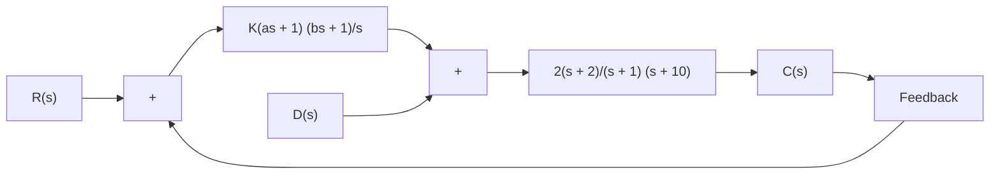
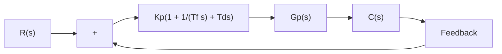

# PROBLEMS

B–8–1. Consider the electronic PID controller shown in Figure 8–70. Determine the values of $R _ { 1 } , R _ { 2 } , R _ { 3 } , R _ { 4 } , C _ { 1 } ,$ and $C _ { 2 }$ of the controller such that the transfer function $G _ { c } ( s ) = E _ { o } ( s ) / E _ { i } ( s )$ is

$$G _ {c} (s) = 3 9. 4 2 \left(1 + \frac {1}{3 . 0 7 7 s} + 0. 7 6 9 2 s\right)= 3 0. 3 2 1 5 \frac {(s + 0 . 6 5) ^ {2}}{s}$$

text_image

C1
R1
R2 C2
Ei(s)
+
-
R3
R4
E(s)
+
-
Eo(s)

Figure 8–70 Electronic PID controller.

B–8–2. Consider the system shown in Figure 8–71. Assume that disturbances D(s) enter the system as shown in the diagram. Determine parameters K, a, and b such that the response to the unit-step disturbance input and the response to the unit-step reference input satisfy the following specifications: The response to the step disturbance input should attenuate rapidly with no steady-state error, and the response to the step reference input exhibits a maximum overshoot of 20% or less and a settling time of 2 sec.

B–8–3. Show that the PID-controlled system shown in Figure 8–72(a) is equivalent to the I-PD-controlled system with feedforward control shown in Figure 8–72(b).

B–8–4. Consider the systems shown in Figures 8–73(a) and (b). The system shown in Figure 8–73(a) is the system designed in Example 8–1. The response to the unit-step reference input in the absence of the disturbance input is shown in Figure 8–10. The system shown in Figure 8–73(b) is the I-PD-controlled system using the same $K _ { p } , T _ { i } $ , and $T _ { d }$ as the system shown in Figure 8–73(a).

flowchart

Figure 8–71 Control system.

flowchart

(a)

flowchart

