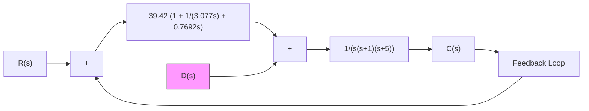
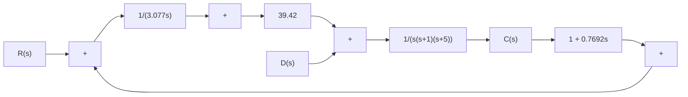

```mermaid
graph LR
    R["s"] --> |+| Sum1["+/-"]
    Sum1 --> |Kp/(Tis)| | +2["+/-"]
    +2 --> Gp["Gp(s)"]
    Gp --> C["s"]
    C["s"] --> |Kp(1 + Tds)| Sum1
    Sum1 --> |Kp(1 + Tds)| Sum2["+/-"]
    Sum2 --> |Kp(1 + Tds)| Sum3["+/-"]
    Sum3 --> Gp
```
</details>

(b)   
Figure 8–72 (a) PID-controlled system; (b) I-PD-controlled system with feedforward control.

Obtain the response of the I-PD-controlled system to the unit-step reference input with MATLAB. Compare the unit-step response curves of the two systems.

B–8–5. Referring to Problem B–8–4, obtain the response of the PID-controlled system shown in Figure $8 \mathrm { - } 7 3 ( \mathrm { a } )$ to the unit-step disturbance input.

Show that for the disturbance input, the responses of the PID-controlled system shown in Figure 8–73(a) and of the I-PD-controlled system shown in Figure 8–73(b) are exactly the same. [When considering $D ( s )$ to be the input, assume that the reference input $R ( s )$ is zero, and vice versa.] Also, compare the closed-loop transfer function $C ( s ) / R ( s )$ of both systems.

B–8–6. Consider the system shown in Figure 8–74.This system is subjected to three input signals: the reference input, disturbance input, and noise input. Show that the characteristic equation of this system is the same regardless of which input signal is chosen as input.


<details>
<summary>flowchart</summary>


</details>

(a)


<details>
<summary>flowchart</summary>


</details>

Figure 8–73 (a) PID-controlled system; (b) I-PD-controlled system.


<details>
<summary>flowchart</summary>
