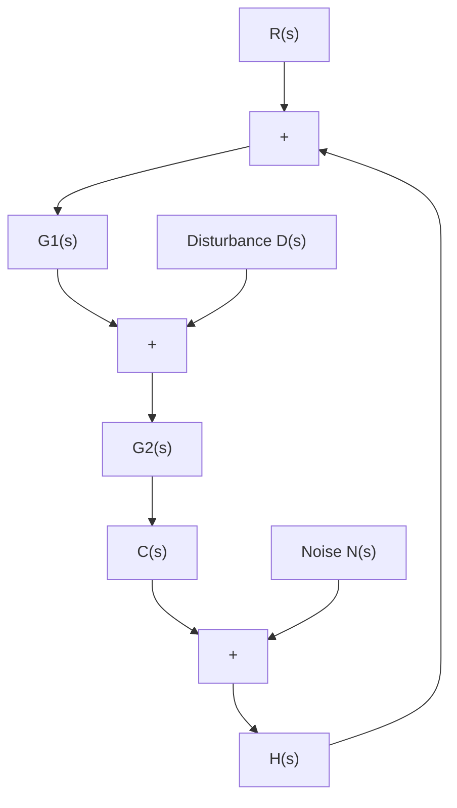
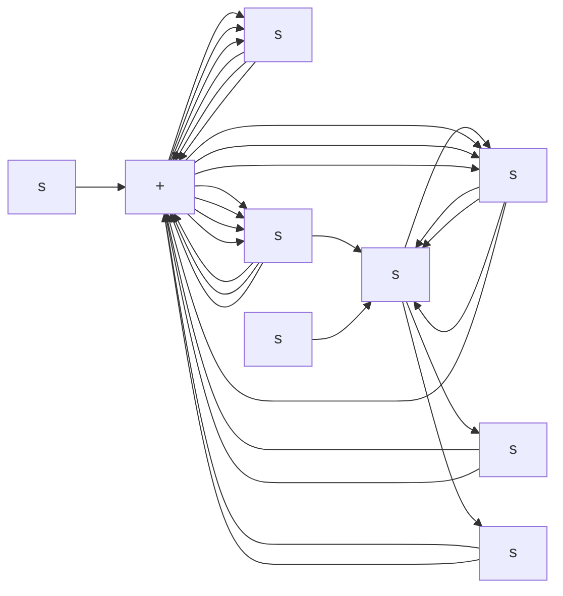

</details>

Figure 8–74 Control system.

B–8–7. Consider the system shown in Figure 8–75. Obtain the closed-loop transfer function $C ( s ) / R ( s )$ for the reference input and the closed-loop transfer function $C ( s ) / D ( s )$ for the disturbance input. When considering $R ( s )$ as the input, assume that $D ( s )$ is zero, and vice versa.

B–8–8. Consider the system shown in Figure $8 \mathrm { - } 7 6 ( \mathrm { a } )$ , where K is an adjustable gain and $G ( s )$ and $H ( s )$ are fixed

components. The closed-loop transfer function for the disturbance is

$$\frac {C (s)}{D (s)} = \frac {1}{1 + K G (s) H (s)}$$

To minimize the effect of disturbances, the adjustable gain K should be chosen as large as possible.

Is this true for the system in Figure $8 - 7 6 ( \mathrm { b } )$ , too?


<details>
<summary>flowchart</summary>


</details>

Figure 8–75 Control system.


<details>
<summary>flowchart</summary>

```mermaid
graph TD
    subgraph (a)
        R["s"] --> |+| Sum1
        Sum1 --> K["K"]
        K --> G["s"]
        G["s"] --> |+| Sum2
        Sum2 --> C["s"]
        D["s"] --> |+| Sum1
        Sum1 --> H["s"]
        H["s"] --> |+| Sum2
        Sum2 --> C["s"]
    end
    subgraph (b)
        R["s"] --> |+| Sum3
        Sum3 --> K["K"]
        K --> G["s"]
        G["s"] --> |+| Sum4
        Sum4 --> C["s"]
        H["s"] --> |+| Sum5
        Sum5 --> D["s"]
        D["s"] --> |+| Sum3
        Sum3 --> C["s"]
    end
```
</details>

Figure 8–76 (a) Control system with disturbance entering in the feedforward path; (b) control system with disturbance entering in the feedback path.
