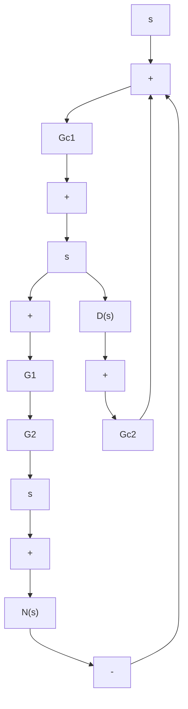

B–8–9. Show that the control systems shown in Figures 8–77(a), (b), and (c) are two-degrees-of-freedom systems. In the diagrams, $G _ { c 1 }$ and $G _ { c 2 }$ are controllers and $G _ { p }$ is the plant.

B–8–10. Show that the control system shown in Figure 8–78 is a three-degrees-of freedom system. The transfer functions $G _ { c 1 } , G _ { c 2 }$ , and $G _ { c 3 }$ are controllers. The plant consists of transfer functions $G _ { 1 }$ and $G _ { 2 }$ .

flowchart

Figure 8–77 (a), (b), (c) Two degrees-of-freedom systems.   
Figure 8–78 Three-degrees-offreedom system.

B–8–11. Consider the control system shown in Figure 8–79. Assume that the PID controller is given by

$$G _ {c} (s) = K \frac {(s + a) ^ {2}}{s}$$

It is desired that the unit-step response of the system exhibit the maximum overshoot of less than 10%, but more than 2% (to avoid an almost overdamped system), and the settling time be less than 2 sec.

Using the computational approach presented in Section 8–4, write a MATLAB program to determine the values of K and a that will satisfy the given specifications. Choose the search region to be

$$1 \leq K \leq 4, \quad 0. 4 \leq a \leq 4$$

Choose the step size for K and a to be 0.05. Write the program such that the nested loops start with the highest values of K and a and step toward the lowest.

Using the first-found solution, plot the unit-step response curve.

B–8–12. Consider the same control system as treated in Problem B–8–11 (Figure 8–79). The PID controller is given by

$$G _ {c} (s) = K \frac {(s + a) ^ {2}}{s}$$

It is desired to determine the values of K and a such that the unit-step response of the system exhibits the maximum overshoot of less than 8%, but more than 3%, and the settling time is less than 2 sec. Choose the search region to be

$$2 \leq K \leq 4, \quad 0. 5 \leq a \leq 3$$

Choose the step size for K and a to be 0.05.
