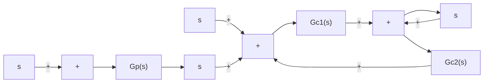
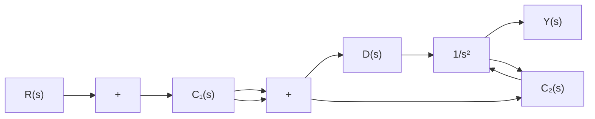

Determine the controllers $G _ { c 1 } ( s )$ and $G _ { c 2 } ( s )$ such that, for the step disturbance input, the response shows a small amplitude and approaches zero quickly (in a matter of 1 to 2 sec). For the response to the unit-step reference input, it is desired that the maximum overshoot be 20% or less and the settling time 1 sec or less. For the ramp reference input and acceleration reference input, the steady-state errors should be zero.

B–8–15. Consider the two-degrees-of-freedom control system shown in Figure 8–82. Design controllers $G _ { c 1 } ( s )$ and $G _ { c 2 } ( s )$ such that the response to the step disturbance input shows a small amplitude and settles to zero quickly (in 1 to 2 sec) and the response to the step reference input exhibits 25% or less maximum overshoot and the settling time is less than 1 sec.The steady-state error in following the ramp reference input or acceleration reference input should be zero.

flowchart

Figure 8–81 Two-degrees-of-freedom control system.

flowchart

Figure 8–82 Two-degrees-of-freedom control system.

text_image

9

