```mermaid
graph TD
    A["u"] --> B["+"]
    B --> C["∫"]
    C --> D["x_n"]
    D --> E["∫"]
    E --> F["x_{n-1}"]
    F --> G["a_1"]
    G --> H["+"]
    H --> I["∫"]
    I --> J["x_2"]
    J --> K["a_{n-1}"]
    K --> L["+"]
    L --> M["∫"]
    M --> N["x_1"]
    N --> O["+"]
    O --> P["∫"]
    P --> Q["x_n"]
    Q --> R["+"]
    R --> S["∫"]
    S --> T["x_n-1"]
    T --> U["a_2"]
    U --> V["+"]
    V --> W["∫"]
    W --> X["x_1"]
    X --> Y["+"]
    Y --> Z["∫"]
    Z --> AA["x_n-1"]
    AA --> AB["a_n"]
    AB --> AC["+"]
    AC --> AD["∫"]
    AD --> AE["x_n-1"]
    AE --> AF["a_1"]
    AF --> AG["+"]
    AG --> AH["∫"]
    AH --> AI["x_n-1"]
    AI --> AJ["a_2"]
    AJ --> AK["+"]
    AK --> AL["∫"]
    AL --> AM["x_n-1"]
    AM --> AN["a_n"]
    AN --> AO["+"]
    AO --> AP["∫"]
    AP --> AQ["x_n-1"]
    AQ --> AR["a_n"]
    AR --> AS["+"]
    AS --> AT["∫"]
    AT --> AU["x_n-1"]
    AU --> AV["a_2"]
    AV --> AW["+"]
    AW --> AX["∫"]
    AX --> AY["x_n-1"]
    AY --> AZ["a_n"]
```

A–9–2. Consider the following transfer-function system:

$$\frac {Y (s)}{U (s)} = \frac {b _ {0} s ^ {n} + b _ {1} s ^ {n - 1} + \cdots + b _ {n - 1} s + b _ {n}}{s ^ {n} + a _ {1} s ^ {n - 1} + \cdots + a _ {n - 1} s + a _ {n}} \tag {9-77}$$

Derive the following observable canonical form of the state-space representation for this transferfunction system:

$$
\left[ \begin{array}{c} \dot {x} _ {1} \\ \dot {x} _ {2} \\ \cdot \\ \cdot \\ \cdot \\ \dot {x} _ {n} \end{array} \right] = \left[ \begin{array}{c c c c c} 0 & 0 & \dots & 0 & - a _ {n} \\ 1 & 0 & \dots & 0 & - a _ {n - 1} \\ \cdot & \cdot & & \cdot & \cdot \\ \cdot & \cdot & & \cdot & \cdot \\ \cdot & \cdot & & \cdot & \cdot \\ 0 & 0 & \dots & 1 & - a _ {1} \end{array} \right] \left[ \begin{array}{c} x _ {1} \\ x _ {2} \\ \cdot \\ \cdot \\ \cdot \\ x _ {n} \end{array} \right] + \left[ \begin{array}{c} b _ {n} - a _ {n} b _ {0} \\ b _ {n - 1} - a _ {n - 1} b _ {0} \\ \cdot \\ \cdot \\ \cdot \\ b _ {1} - a _ {1} b _ {0} \end{array} \right] u \tag {9-78}

y = \left[ \begin{array}{l l l l l} 0 & 0 & \dots & 0 & 1 \end{array} \right] \left[ \begin{array}{c} x _ {1} \\ x _ {2} \\ \cdot \\ \cdot \\ \cdot \\ x _ {n - 1} \\ x _ {n} \end{array} \right] + b _ {0} u \tag {9-79}
$$

Solution. Equation (9–77) can be modified into the following form:

$$s ^ {n} \big [ Y (s) - b _ {0} U (s) \big ] + s ^ {n - 1} \big [ a _ {1} Y (s) - b _ {1} U (s) \big ] + \dots+ s \left[ a _ {n - 1} Y (s) - b _ {n - 1} U (s) \right] + a _ {n} Y (s) - b _ {n} U (s) = 0$$

By dividing the entire equation by $s ^ { n }$ and rearranging, we obtain

$$Y (s) = b _ {0} U (s) + \frac {1}{s} \left[ b _ {1} U (s) - a _ {1} Y (s) \right] + \dots+ \frac {1}{s ^ {n - 1}} \left[ b _ {n - 1} U (s) - a _ {n - 1} Y (s) \right] + \frac {1}{s ^ {n}} \left[ b _ {n} U (s) - a _ {n} Y (s) \right] \tag {9-80}$$
