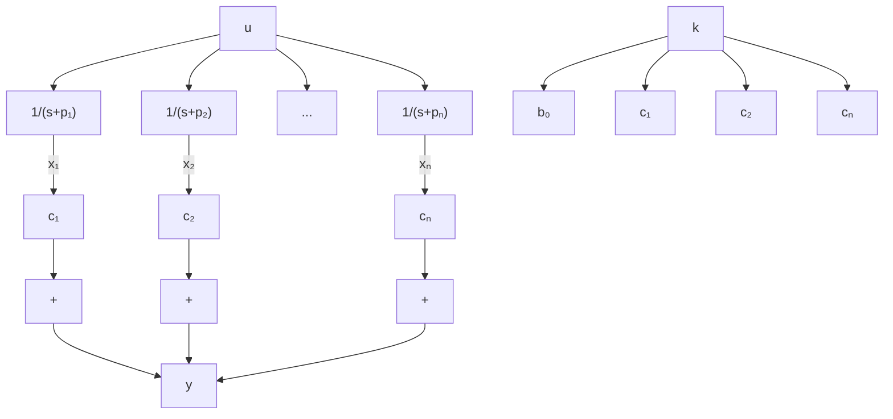

$$
\dot {x} _ {1} = - p _ {1} x _ {1} + u\dot {x} _ {2} = - p _ {2} x _ {2} + u
\begin{array}{l} \cdot \\ \cdot \\ \cdot \end{array} \tag {9-87}
\dot {x} _ {n} = - p _ {n} x _ {n} + u
$$

These n equations make up a state equation.

In terms of the state variables $X _ { 1 } ( s ) , X _ { 2 } ( s ) , \ldots , X _ { n } ( s )$ , Equation (9–86) can be written as

$$Y (s) = b _ {0} U (s) + c _ {1} X _ {1} (s) + c _ {2} X _ {2} (s) + \dots + c _ {n} X _ {n} (s)$$

The inverse Laplace transform of this last equation is

$$y = c _ {1} x _ {1} + c _ {2} x _ {2} + \dots + c _ {n} x _ {n} + b _ {0} u \tag {9-88}$$

which is the output equation.

Equation (9–87) can be put in the vector-matrix equation as given by Equation (9–84). Equation (9–88) can be put in the form of Equation (9–85).

Figure 9–3 shows a block diagram representation of the system defined by Equations (9–84) and (9–85).

It is noted that if we choose the state variables as

$$
\hat {X} _ {1} (s) = \frac {c _ {1}}{s + p _ {1}} U (s)\hat {X} _ {2} (s) = \frac {c _ {2}}{s + p _ {2}} U (s)
\begin{array}{c} \bullet \\ \bullet \\ \bullet \end{array}
\hat {X} _ {n} (s) = \frac {c _ {n}}{s + p _ {n}} U (s)
$$

flowchart

Figure 9–3

Block diagram representation of the system defined by Equations (9–84) and (9–85) (diagonal canonical form).

then we get a slightly different state-space representation. This choice of state variables gives

$$s \hat {X} _ {1} (s) = - p _ {1} \hat {X} _ {1} (s) + c _ {1} U (s)s \hat {X} _ {2} (s) = - p _ {2} \hat {X} _ {2} (s) + c _ {2} U (s)s \hat {X} _ {n} (s) = - p _ {n} \hat {X} _ {n} (s) + c _ {n} U (s)$$

from which we obtain

$$\dot {\hat {x}} _ {1} = - p _ {1} \hat {x} _ {1} + c _ {1} u\dot {\hat {x}} _ {2} = - p _ {2} \hat {x} _ {2} + c _ {2} u$$

(9–89)

$$\dot {\hat {x}} _ {n} = - p _ {n} \hat {x} _ {n} + c _ {n} u$$

Referring to Equation (9–86), the output equation becomes

$$Y (s) = b _ {0} U (s) + \hat {X} _ {1} (s) + \hat {X} _ {2} (s) + \dots + \hat {X} _ {n} (s)$$

from which we get

$$y = \hat {x} _ {1} + \hat {x} _ {2} + \dots + \hat {x} _ {n} + b _ {0} u \tag {9-90}$$

Equations (9–89) and (9–90) give the following state-space representation for the system:
