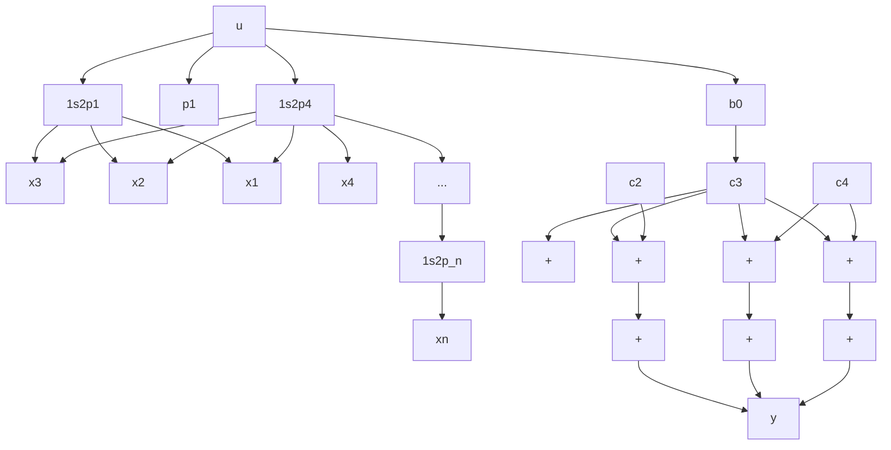

Solution. MATLAB command

$$[ A, B, C, D ] = t f 2 s s (n u m, d e n)$$

will produce a state-space representation for the system. See MATLAB Program 9–4.

<table><tr><td colspan="3">MATLAB Program 9-4</td></tr><tr><td colspan="3">num = [25.04 5.008];den = [1 5.03247 25.1026 5.008];[A,B,C,D] = tf2ss(num,den)</td></tr><tr><td>A =</td><td></td><td></td></tr><tr><td>-5.0325</td><td>-25.1026</td><td>-5.0080</td></tr><tr><td>1.0000</td><td>0</td><td>0</td></tr><tr><td>0</td><td>1.0000</td><td>0</td></tr><tr><td>B =</td><td></td><td></td></tr><tr><td>1</td><td></td><td></td></tr><tr><td>0</td><td></td><td></td></tr><tr><td>0</td><td></td><td></td></tr><tr><td>C =</td><td></td><td></td></tr><tr><td>0</td><td>25.0400</td><td>5.0080</td></tr><tr><td>D =</td><td></td><td></td></tr><tr><td>0</td><td></td><td></td></tr></table>

This is the MATLAB representation of the following state-space equations:

$$
\left[ \begin{array}{c} \dot {x} _ {1} \\ \dot {x} _ {2} \\ \dot {x} _ {3} \end{array} \right] = \left[ \begin{array}{c c c} - 5. 0 3 2 5 & - 2 5. 1 0 2 6 & - 5. 0 0 8 \\ 1 & 0 & 0 \\ 0 & 1 & 0 \end{array} \right] \left[ \begin{array}{c} x _ {1} \\ x _ {2} \\ x _ {3} \end{array} \right] + \left[ \begin{array}{c} 1 \\ 0 \\ 0 \end{array} \right] u

y = \left[ \begin{array}{l l l} 0 & 2 5. 0 4 & 5. 0 0 8 \end{array} \right] \left[ \begin{array}{l} x _ {1} \\ x _ {2} \\ x _ {3} \end{array} \right] + [ 0 ] u
$$

A–9–6. Consider the system defined by

$$\dot {\mathbf {x}} = \mathbf {A} \mathbf {x} + \mathbf {B} \mathbf {u}$$

where x = state vector (n-vector)

$$\mathbf {u} = \text { control vector } (r \text {-vector})$$

A = n \* n constant matrix

B = n \* r constant matrix

Obtain the response of the system to each of the following inputs:

(a) The r components of u are impulse functions of various magnitudes.   
(b) The r components of u are step functions of various magnitudes.   
(c) The r components of u are ramp functions of various magnitudes.
