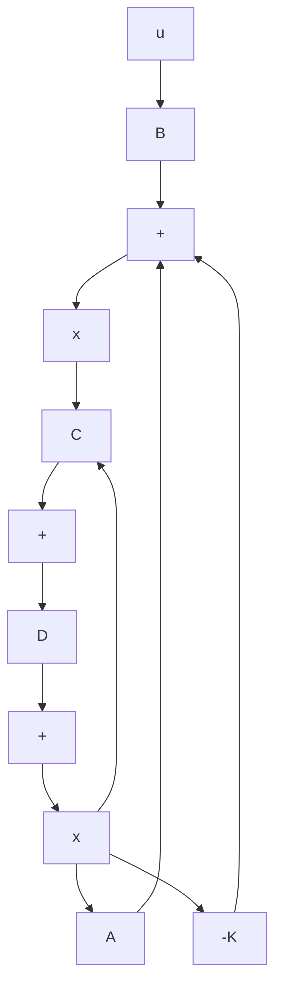

$$\dot {\mathbf {x}} (t) = (\mathbf {A} - \mathbf {B K}) \mathbf {x} (t)$$

The solution of this equation is given by

$$\mathbf {x} (t) = e ^ {(\mathbf {A} - \mathbf {B K}) t} \mathbf {x} (0) \tag {10-3}$$

where x(0) is the initial state caused by external disturbances.The stability and transientresponse characteristics are determined by the eigenvalues of matrix A-BK. If matrix

flowchart

Figure 10–1 Closed-loop control system with u=–Kx.

K is chosen properly, the matrix A-BK can be made an asymptotically stable matrix, and for all $\mathbf { x } ( 0 ) \neq \mathbf { 0 }$ , it is possible to make ${ \bf x } ( t )$ approach 0 as t approaches infinity. The eigenvalues of matrix A-BK are called the regulator poles. If these regulator poles are placed in the left-half s plane, then ${ \bf x } ( t )$ approaches 0 as t approaches infinity.The problem of placing the regulator poles (closed-loop poles) at the desired location is called a pole-placement problem.

In what follows, we shall prove that arbitrary pole placement for a given system is possible if and only if the system is completely state controllable.

Necessary and Sufficient Condition for Arbitrary Pole Placement We shall now prove that a necessary and sufficient condition for arbitrary pole placement is that the system be completely state controllable.We shall first derive the necessary condition.We begin by proving that if the system is not completely state controllable, then there are eigenvalues of matrix A-BK that cannot be controlled by state feedback.

Suppose that the system of Equation (10–1) is not completely state controllable. Then the rank of the controllability matrix is less than n, or

$$
\operatorname{rank} \left[ \begin{array}{c c c c} \mathbf {B} & \mathbf {A B} & \dots & \mathbf {A} ^ {n - 1} \mathbf {B} \end{array} \right] = q <   n
$$
