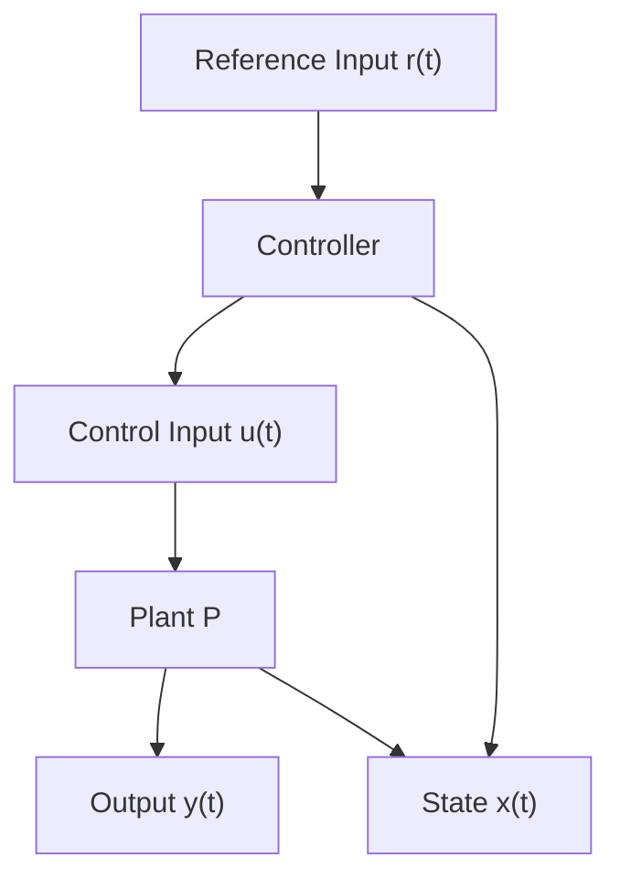
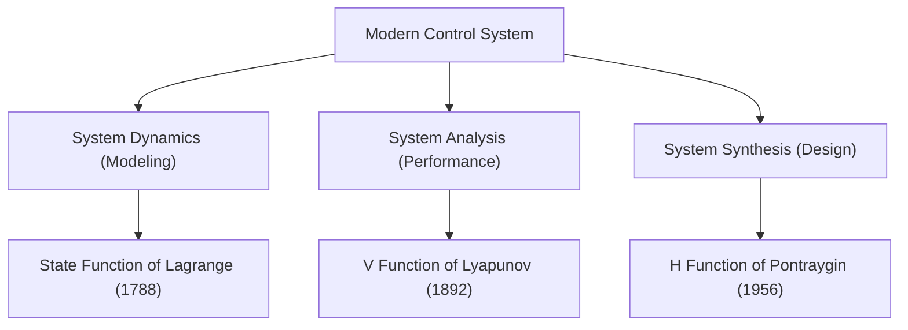

1. the input $\mathbf{u}(t)$ is determined by the controller (consisting of error detector and compensator) driven by system states $\mathbf{x}(t)$ and reference signal $\mathbf{r}(t)$ ,   
2. all or most of the state variables are available for control, and   
3. it depends on well-established matrix theory, which is amenable for large scale computer simulation.

flowchart

Figure 1.2 Modern Control Configuration

The fact that the state variable representation uniquely specifies the transfer function while there are a number of state variable representations for a given transfer function, reveals the fact that state variable representation is a more complete description of a system.

Figure 1.3 shows components of a modern control system. It shows three components of modern control and their important contributors. The first stage of any control system theory is to obtain or formulate the dynamics or modeling in terms of dynamical equations such as differential or difference equations. The system dynamics is largely based on the Lagrangian function. Next, the system is analyzed for its performance to find out mainly stability of the system and the contributions of Lyapunov to stability theory are well known. Finally, if the system performance is not according to our specifications, we resort to design [25, 109]. In optimal control theory, the design is usually with respect to a performance index. We notice that although the concepts such as Lagrange function [85] and V function of Lyapunov [94] are old, the techniques using those concepts are modern. Again, as the phrase modern usually refers to time and what is modern today becomes ancient after a few years, a more appropriate thing is to label them as optimal control, nonlinear control, adaptive control, robust control and so on.

flowchart

Figure 1.3 Components of a Modern Control System
