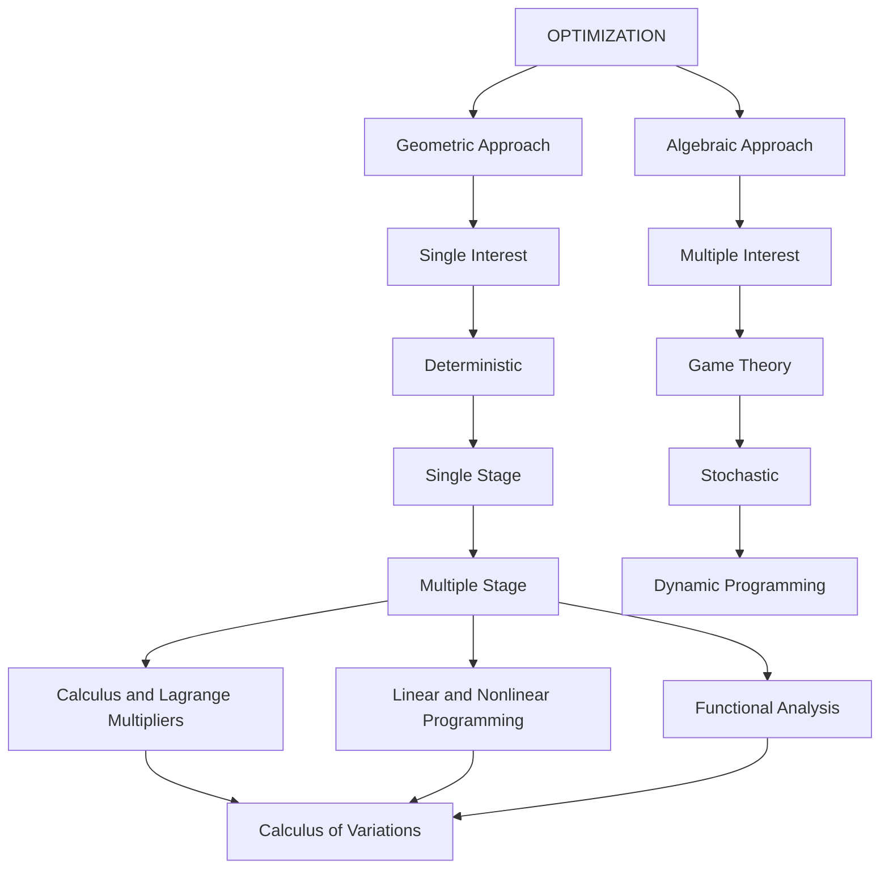

# 1.2 Optimization

Optimization is a very desirable feature in day-to-day life. We like to work and use our time in an optimum manner, use resources optimally and so on. The subject of optimization is quite general in the sense that it can be viewed in different ways depending on the approach (algebraic or geometric), the interest (single or multiple), the nature of the signals (deterministic or stochastic), and the stage (single or multiple) used in optimization. This is shown in Figure 1.4. As we notice that the calculus of variations is one small area of the big picture of the optimization field, and it forms the basis for our study of optimal control systems. Further, optimization can be classified as static optimization and dynamic optimization.

1. Static Optimization is concerned with controlling a plant under steady state conditions, i.e., the system variables are not changing with respect to time. The plant is then described by algebraic equations. Techniques used are ordinary calculus, Lagrange multipliers, linear and nonlinear programming.   
2. Dynamic Optimization concerns with the optimal control of plants under dynamic conditions, i.e., the system variables are changing with respect to time and thus the time is involved in system description. Then the plant is described by differential

flowchart

Figure 1.4 Overview of Optimization

(or difference) equations. Techniques used are search techniques, dynamic programming, variational calculus (or calculus of variations) and Pontryagin principle.
