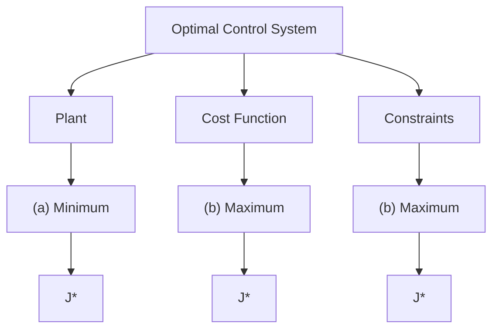

# 1.3.4 Formal Statement of Optimal Control System

Let us now state formally the optimal control problem even risking repetition of some of the previous equations. The optimal control problem is to find the optimal control $\mathbf{u}^{*}(t)$ (\* indicates extremal or optimal value) which causes the linear time-invariant plant (system)

$$\dot {\mathbf {x}} (t) = \mathbf {A} \mathbf {x} (t) + \mathbf {B} \mathbf {u} (t) \tag {1.3.11}$$

to give the trajectory $\mathbf{x}^{*}(t)$ that optimizes or extremizes (minimizes or maximizes) a performance index

$$J = \mathbf {x} ^ {\prime} (t _ {f}) \mathbf {F x} (t _ {f}) + \int_ {t _ {0}} ^ {t _ {f}} [ \mathbf {x} ^ {\prime} (t) \mathbf {Q x} (t) + \mathbf {u} ^ {\prime} (t) \mathbf {R u} (t) ] d t \tag {1.3.12}$$

or which causes the nonlinear system

$$\dot {\mathbf {x}} (t) = \mathbf {f} (\mathbf {x} (t), \mathbf {u} (t), t) \tag {1.3.13}$$

to give the state $\mathbf{x}^{*}(t)$ that optimizes the general performance index

$$J = S (\mathbf {x} (t _ {f}), t _ {f}) + \int_ {t _ {0}} ^ {t _ {f}} V (\mathbf {x} (t), \mathbf {u} (t), t) d t \tag {1.3.14}$$

with some constraints on the control variables $\mathbf{u}(t)$ and/or the state variables $\mathbf{x}(t)$ given by (1.3.10). The final time $t_{f}$ may be fixed, or free, and the final (target) state may be fully or partially fixed or free. The entire problem statement is also shown pictorially in Figure 1.5. Thus,

flowchart

Figure 1.5 Optimal Control Problem

we are basically interested in finding the control $\mathbf{u}^{*}(t)$ which when applied to the plant described by (1.3.11) or (1.3.13), gives an optimal performance index $J^{*}$ described by (1.3.12) or (1.3.14).

The optimal control systems are studied in three stages.

1. In the first stage, we just consider the performance index of the form (1.3.14) and use the well-known theory of calculus of variations to obtain optimal functions.   
2. In the second stage, we bring in the plant (1.3.11) and try to address the problem of finding optimal control $\mathbf{u}^{*}(t)$ which will
