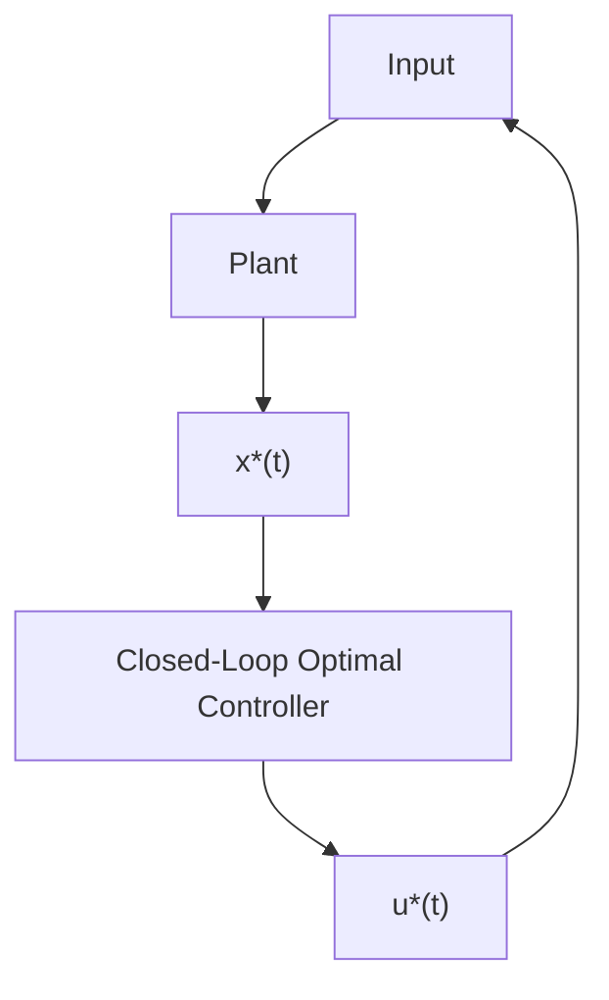

(a) The state and costate equations (2.8.30) and (2.8.32) are solved using the initial and final conditions. In general, these are nonlinear, time varying and we may have to resort to numerical methods for their solutions.   
(b) We note that the state and costate equations are the same for any kind of boundary conditions.   
(c) For the optimal control system, although obtaining the state and costate equations is very easy, the computation of their solutions is quite tedious. This is the unfortunate feature of optimal control theory. It is the price one must pay for demanding the best performance from a system. One has to weigh the optimization of the system against the computational burden.

7. Open-Loop Optimal Control: In solving the TPBVP arising due to the state and costate equations, and then substituting in the control equation, we get only the open-loop optimal control as shown in Figure 2.15. Here, one has to construct or realize an open-loop optimal controller (OLOC) and in many cases it is very tedious. Also, changes in plant parameters are not taken into account by the OLOC. This prompts us to think in terms of a closed-loop optimal control (CLOC), i.e., to obtain optimal control $\mathbf{u}^{*}(t)$ in terms of the state $\mathbf{x}^{*}(t)$ as shown in Figure 2.16. This CLOC will have many advantages such as sensitive to plant parameter variations and simplified construction of the controller. The closed-loop optimal control systems are discussed in Chapter 7.

flowchart

Figure 2.16 Closed-Loop Optimal Control
