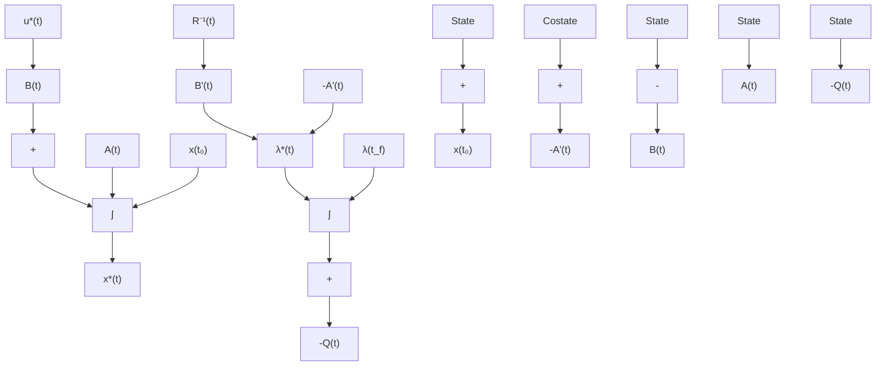

where, S equals the entire terminal cost term in the cost functional (3.2.2). Here, for our present system $t_{f}$ is specified which makes $\delta t_{f}$ equal to zero in (3.2.9), and $\mathbf{x}(t_{f})$ is not specified which makes $\delta x_{f}$ arbitrary in (3.2.9). Hence, the coefficient of $\delta x_{f}$ in (3.2.9) becomes zero, that is,

$$
\begin{array}{l} \boldsymbol {\lambda} ^ {*} (t _ {f}) = \left(\frac {\partial S}{\partial \mathbf {x} (t _ {f})}\right) _ {*} \\ = \frac {\partial \left[ \frac {1}{2} \mathbf {x} ^ {\prime} (t _ {f}) \mathbf {F} (t _ {f}) \mathbf {x} (t _ {f}) \right]}{\partial \mathbf {x} (t _ {f})} = \mathbf {F} (t _ {f}) \mathbf {x} ^ {*} (t _ {f}). \tag {3.2.10} \\ \end{array}
$$

This final condition on the costate $\boldsymbol{\lambda}^{*}(t_{f})$ together with the initial condition on the state $x_{0}$ and the canonical system of equations (3.2.8) form a two-point, boundary value problem (TPBVP). The state-space representation of the set of relations for the state and costate system (3.2.8) and the control (3.2.5) is shown in Figure 3.1.

flowchart

Figure 3.1 State and Costate System
