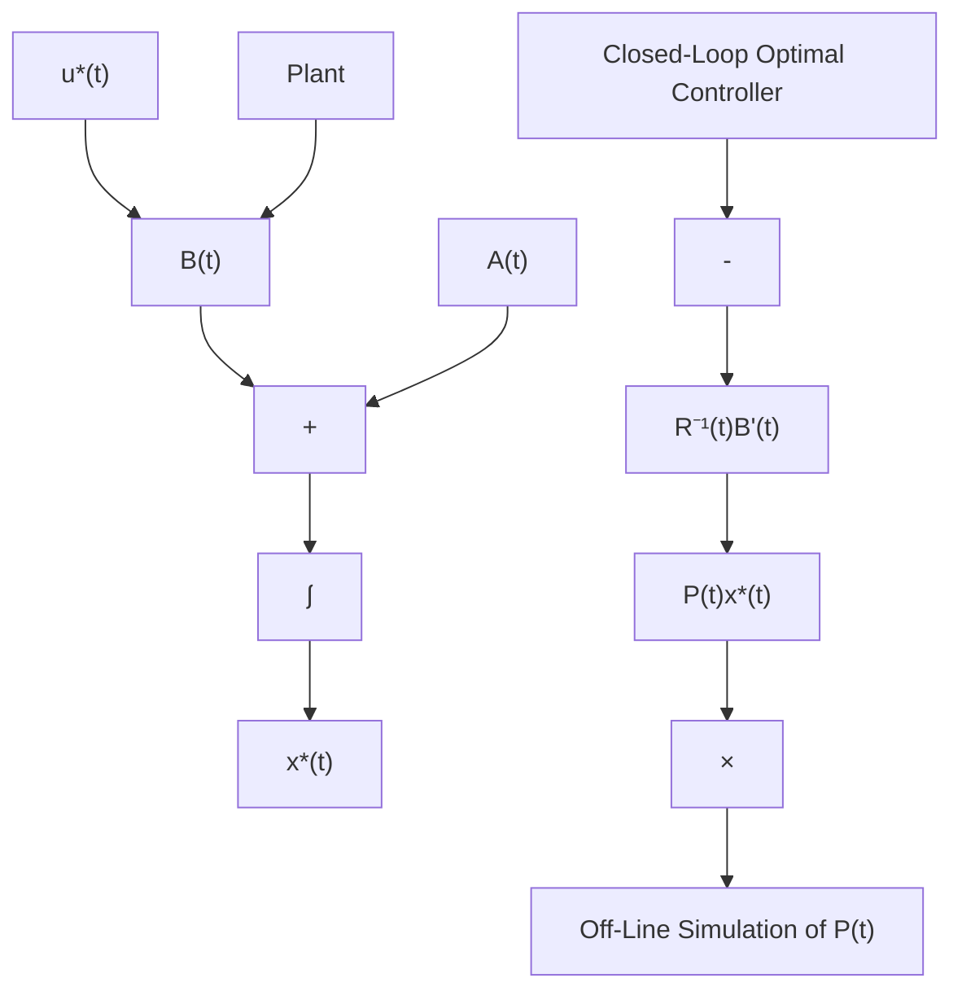

where, $\mathbf{K}_{a}(t)=\mathbf{P}(t)\mathbf{B}(t)\mathbf{R}^{-1}(t)$ . The previous optimal control is linear in state $\mathbf{x}^{*}(t)$ . This is one of the nice features of the optimal control of linear systems with quadratic cost functionals. Also, note that the negative feedback in the optimal control relation (3.2.46) emerged from the theory of optimal control and was not introduced intentionally in our development.

flowchart

Figure 3.2 Closed-Loop Optimal Control Implementation

11. Controllability: Do we need the controllability condition on the system for implementing the optimal feedback control? No, as long as we are dealing with a finite time $(t_{f})$ system, because the contribution of those uncontrollable states (which are also unstable) to the cost function is still a finite quantity only. However, if we consider an infinite time interval, we certainly need the controllability condition, as we will see in the next section.

A historical note is very appropriate on the Riccati equation [22, 132].

The matrix Riccati equation has its origin in the scalar version of the equation

$$\dot {x} (t) = a x ^ {2} (t) + b x (t) + c \tag {3.2.47}$$

with time varying coefficients, proposed by Jacopo Francesco Riccati around 1715. Riccati (1676-1754) gave the methods of solutions to the Riccati equation. However, the original paper by Riccati was not published immediately because he had the “suspicion” that the work was already known to people such as the Bernoullis.
