# 3.4 Infinite-Time LQR System I

In this section, let us make the terminal (final) time $t_{f}$ to be infinite in the previous linear, time-varying, quadratic regulator system. Then, this is called the infinite-time (or infinite horizon) linear quadratic regulator system [6, 3].

Consider a linear, time-varying plant

$$\dot {\mathbf {x}} (t) = \mathbf {A} (t) \mathbf {x} (t) + \mathbf {B} (t) \mathbf {u} (t), \tag {3.4.1}$$

and a quadratic performance index

$$J = \frac {1}{2} \int_ {t _ {0}} ^ {\infty} \left[ \mathbf {x} ^ {\prime} (t) \mathbf {Q} (t) \mathbf {x} (t) + \mathbf {u} ^ {\prime} (t) \mathbf {R} (t) \mathbf {u} (t) \right] d t, \tag {3.4.2}$$

where, $\mathbf{u}(t)$ is not constrained. Also, $\mathbf{Q}(t)$ is nxn symmetric, positive semidefinite matrix, and $\mathbf{R}(t)$ is an rxr symmetric, positive definite matrix. Note, it makes no engineering sense to have a terminal cost term with terminal time being infinite.

This problem cannot always be solved without some special conditions. For example, if any one of the states is uncontrollable and/or unstable, the corresponding performance measure J will become infinite and makes no physical sense. On the other hand, with the finite-time system, the performance measure is always finite. Thus, we need to impose the condition that the system $(3.4.1)$ is completely controllable.

```mermaid
graph TD
    subgraph "Plant"
        A["+"] --> B["∫"]
        B --> C["x2*(t)"]
        C --> D["∫"]
        D --> E["x1*(t)"]
        F["u*(t)"] --> G["+"]
        H["-"] --> I["+"]
        J["+"] --> K["∫"]
        L["+"] --> M["∫"]
        N["+"] --> O["+"] --> P["p22(t)"]
        Q["+"] --> R["p12(t)"]
        S["+"] --> T["+"] --> U["+"] --> V["+"] --> W["+"] --> X["+"] --> Y["+"] --> Z["+"] --> AA["+"] --> AB["+"] --> AC["+"] --> AD["+"] --> AE["+"] --> AF["+"] --> AG["+"] --> AH["+"] --> AI["+"] --> AJ["+"] --> AK["+"] --> AL["+"] --> AM["+"] --> AN["+"] --> AO["+"] --> AP["+"] --> AQ["+"] --> AR["+"] --> AS["+"] --> AT["+"] --> AU["+"] --> AV["+"] --> AW["+"] --> AX["+"] --> AY["+"] --> Z
    end
    subgraph "Closed-Loop Optimal Controller"
        B --> Y
        C --> D
        D --> E
        E --> F
        F --> G
        G --> H
        H --> I
        I --> J
        J --> K
        K --> L
        L --> M
        M --> N
        N --> O
        O --> P
        P --> Q
        Q --> R
        R --> S
        S --> T
        T --> U
        U --> V
        V --> W
        W --> X
        X --> Y
        Y --> Z
        Z --> AA
        AA --> AB
        AB --> AC
        AC --> AD
        AD --> AE
        AE --> AF
        AF --> AG
        AG --> AH
    end
```

flowchart

