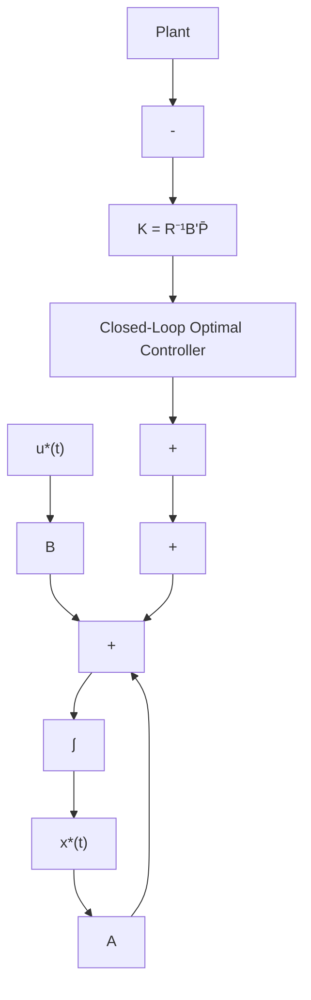

# 3.5.3 Infinite-Interval Regulator System: Time-Invariant Case: Summary

For a controllable, linear, time-invariant plant

$$\dot {\mathbf {x}} (t) = \mathbf {A} \mathbf {x} (t) + \mathbf {B} \mathbf {u} (t), \tag {3.5.12}$$

and the infinite interval cost functional

$$J = \frac {1}{2} \int_ {0} ^ {\infty} \left[ \mathbf {x} ^ {\prime} (t) \mathbf {Q x} (t) + \mathbf {u} ^ {\prime} (t) \mathbf {R u} (t) \right] d t, \tag {3.5.13}$$

the optimal control is given by

$$\boxed {\mathbf {u} ^ {*} (t) = - \mathbf {R} ^ {- 1} \mathbf {B} ^ {\prime} \bar {\mathbf {P}} \mathbf {x} ^ {*} (t)} \tag {3.5.14}$$

where, $\bar{P}$ , the nxn constant, positive definite, symmetric matrix, is the solution of the nonlinear, matrix algebraic Riccati equation (ARE)

$$- \bar {\mathbf {P}} \mathbf {A} - \mathbf {A} ^ {\prime} \bar {\mathbf {P}} + \bar {\mathbf {P}} \mathbf {B R} ^ {- 1} \mathbf {B} ^ {\prime} \bar {\mathbf {P}} - \mathbf {Q} = 0 \tag {3.5.15}$$

the optimal trajectory is the solution of

$$\dot {\mathbf {x}} ^ {*} (t) = \left[ \mathbf {A} - \mathbf {B R} ^ {- 1} \mathbf {B} ^ {\prime} \bar {\mathbf {P}} \right] \mathbf {x} ^ {*} (t) \tag {3.5.16}$$

and the optimal cost is given by

$$\boxed {J ^ {*} = \frac {1}{2} \mathbf {x} ^ {* \prime} (t) \bar {\mathbf {P}} \mathbf {x} ^ {*} (t).} \tag {3.5.17}$$

The entire procedure is now summarized in Table 3.3 and the implementation of the closed-loop optimal control (CLOC) is shown in Figure 3.8

flowchart

Figure 3.8 Implementation of the Closed-Loop Optimal Control: Infinite Final Time

Next, an example is given to illustrate the infinite interval regulator system and the associated matrix algebraic Riccati equation. Let us reconsider the same Example 3.1 with final time $t_{f} \rightarrow \infty$ and F = 0.
