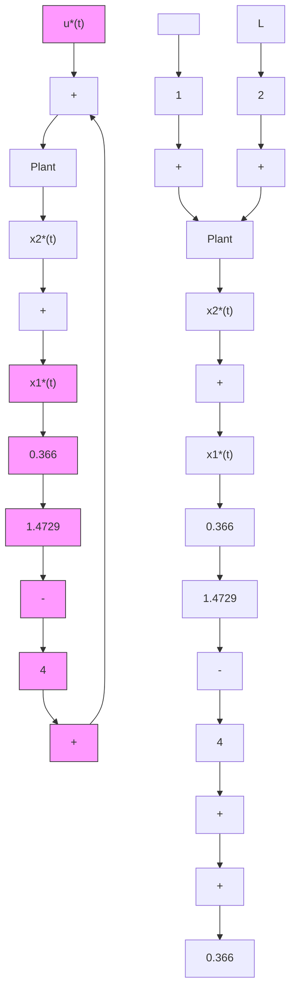

</details>

Figure 3.9 Closed-Loop Optimal Control System

The previous results can also easily obtained using Control System Toolbox of the MATLAB $^{©}$ , Version 6 as shown below.

```matlab
**************************
% Solution using Control System Toolbox in
% The MATLAB. Version 6
% For Example:4-3
%
x10=2; % initial condition on state x1
x20=-3; % initial condition on state x2
X0=[x10;x20];
A=[0 1;-2 1]; % system matrix A
B=[0;1]; % system matrix B
Q=[2 3;3 5]; % performance index weighted matrix
R=[0.25]; % performance index weighted matrix
[K,P,EV]=lqr(A,B,Q,R) % K = feedback matrix;
% P = Riccati matrix;
% EV = eigenvalues of closed loop system A - B*K
K = 
```

```matlab
1.4641 5.8916
P =
1.7363 0.3660
0.3660 1.4729
EV =
-4.0326
-0.8590
BIN=[0;0]; % dummy BIN for "initial" command C=[1 1];
D=[1];
tfinal=10;
t=0:0.05:10;
[Y,X,t]=initial(A-B*K,BIN,C,D,X0,tfinal);
x1t=[1 0]*X'; %% extracting x1 from vector X
x2t=[0 1]*X'; %% extracting x2 from vector X
ut=-K*X';
plot(t,x1t,'k',t,x2t,'k')
xlabel('t')
gtext('x_1(t)')
gtext('x_2(t)')
plot(t,ut,'k')
xlabel('t')
gtext('u(t)') 
```

```txt
****************************************************************************************** 
```

Using the optimal control $u^{*}(t)$ given by (3.5.23), the plant equations (3.5.18) are solved using MATLAB $^{©}$ to obtain the optimal states $x_{1}^{*}(t)$ and $x_{2}^{*}(t)$ and the optimal control $u^{*}(t)$ as shown in Figure 3.10 and Figure 3.11. Note that

1. the values of $\bar{P}$ obtained in the example, are exactly the steady-state values of Example 3.1 and   
2. the original plant (3.5.18) is unstable (eigenvalues at $2 \pm j1$ ) whereas the optimal closed-loop system (3.5.28) is stable (eigenvalues at -4.0326, -0.8590).
