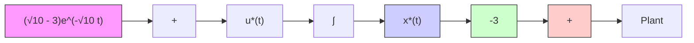
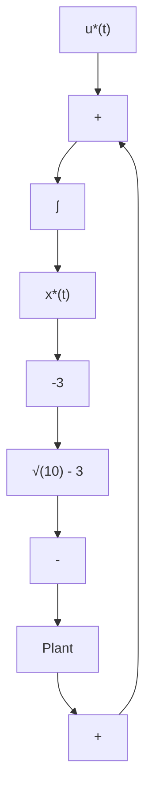

# 3.6 Notes and Discussion

We know that linear quadratic optimal control is concerned with linear plants, performance measures quadratic in controls and states, and regulation and tracking errors. In particular, the resulting optimal controller is closed-loop and linear in state. Note that linear quadratic optimal control is a special class of the general optimal control which includes nonlinear systems and nonlinear performance measures. There are many useful advantages and attractive features of linear quadratic optimal control systems which are enumerated below [3].

flowchart

(a)   

flowchart

CLOC   
(b)   
Figure 3.12 (a) Open-Loop Optimal Controller (OLOC) and (b) Closed-Loop Optimal Controller (CLOC)

1. Many engineering and physical systems operate in linear range during normal operations.   
2. There is a wealth of theoretical results available for linear systems which can be useful for linear quadratic methods.   
3. The resulting optimal controller is linear in state and thus easy and simple for implementation purposes in real application of the LQ results.   
4. Many (nonlinear) optimal control systems do not have solutions which can be easily computed. On the other hand, LQ optimal control systems have easily computable solutions.   
5. As is well known, nonlinear systems can be examined for small variations from their normal operating conditions. For example,

assume that after a heavy computational effort, we obtained an optimal solution for a nonlinear plant and there is a small change from an operating point. Then, one can easily use to a first approximation a linear model and obtain linear optimal control to drive the original nonlinear system to its operating point.

6. Many of the concepts, techniques and computational procedures that are developed for linear optimal control systems in many cases many be carried on to nonlinear optimal control systems.   
7. Linear optimal control designs for plants whose states are measurable possess a number of desirable robustness properties (such as good gain and phase margins and a good tolerance to nonlinearities) of classical control designs.
