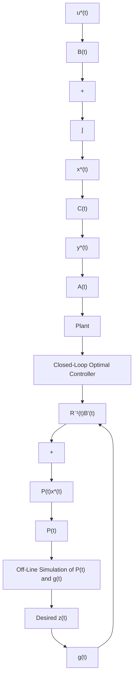

where, the new function $\mathbf{h}(t)$ satisfies [3, 6]

$$
\begin{array}{l} \dot {\mathbf {h}} (t) = - \frac {1}{2} \mathbf {g} ^ {\prime} (t) \mathbf {B} (t) \mathbf {R} ^ {- 1} (t) \mathbf {B} ^ {\prime} (t) \mathbf {g} (t) - \frac {1}{2} \mathbf {z} ^ {\prime} (t) \mathbf {Q} (t) \mathbf {z} (t) \\ = - \frac {1}{2} \mathbf {g} ^ {\prime} (t) \mathbf {E} (t) \mathbf {g} (t) - \frac {1}{2} \mathbf {z} ^ {\prime} (t) \mathbf {Q} (t) \mathbf {z} (t) \tag {4.1.27} \\ \end{array}
$$

with final condition

$$\mathbf {h} (t _ {f}) = - \mathbf {z} ^ {\prime} (t _ {f}) \mathbf {P} (t _ {f}) \mathbf {z} (t _ {f}). \tag {4.1.28}$$

For further details on this, see $[3, 6, 89, 90]$ . We now summarize the tracking system.

flowchart

Figure 4.1 Implementation of the Optimal Tracking System
