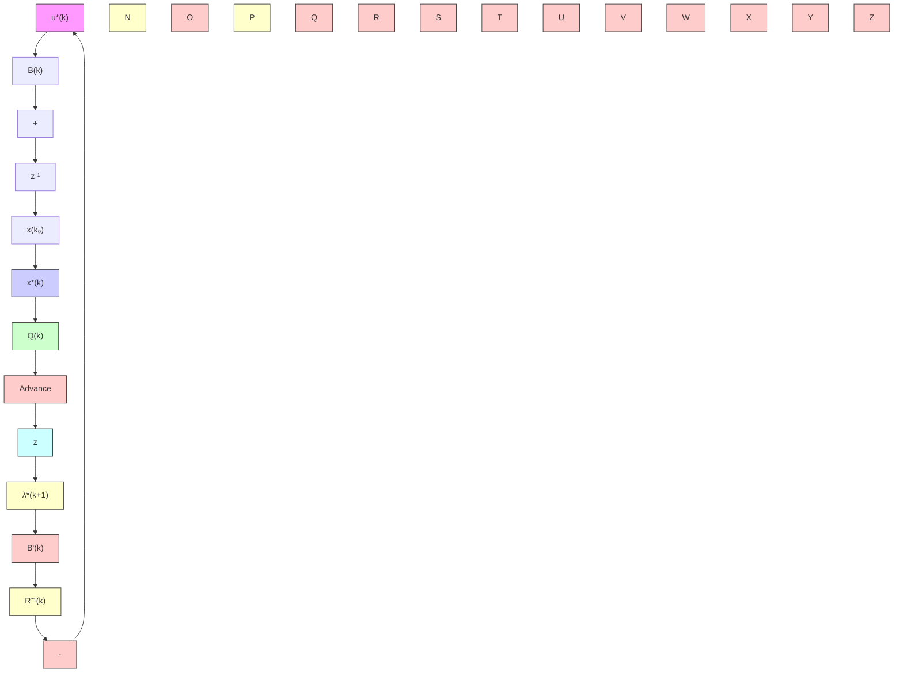

```mermaid
graph TD
    A["u*(k)"] --> B["B(k)"]
    B --> C["+"]
    C --> D["z⁻¹"]
    D --> E["x(k₀)"]
    E --> F["x*(k)"]
    F --> G["Q(k)"]
    G --> H["Advance"]
    H --> I["z"]
    I --> J["λ*(k+1)"]
    J --> K["B'(k)"]
    K --> L["R⁻¹(k)"]
    L --> M["-"]
    M --> A
    style A fill:#f9f,stroke:#333
    style F fill:#ccf,stroke:#333
    style G fill:#cfc,stroke:#333
    style H fill:#fcc,stroke:#333
    style I fill:#cff,stroke:#333
    style J fill:#ffc,stroke:#333
    style K fill:#fcc,stroke:#333
    style L fill:#ffc,stroke:#333
    style M fill:#fcc,stroke:#333
    style N fill:#ffc,stroke:#333
    style O fill:#fcc,stroke:#333
    style P fill:#ffc,stroke:#333
    style Q fill:#fcc,stroke:#333
    style R fill:#fcc,stroke:#333
    style S fill:#fcc,stroke:#333
    style T fill:#fcc,stroke:#333
    style U fill:#fcc,stroke:#333
    style V fill:#fcc,stroke:#333
    style W fill:#fcc,stroke:#333
    style X fill:#fcc,stroke:#333
    style Y fill:#fcc,stroke:#333
    style Z fill:#fcc,stroke:#333
```

Figure 5.1 State and Costate System
