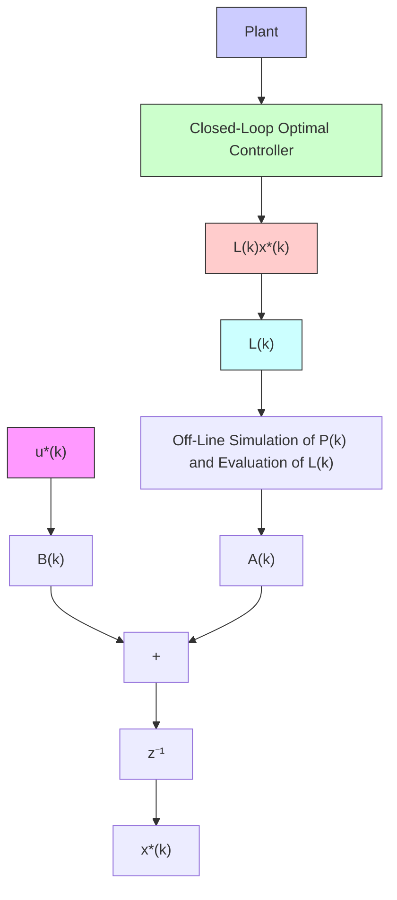

<table><tr><td colspan="2">A. Statement of the Problem</td></tr><tr><td colspan="2">Given the plant as $\mathbf{x}(k+1) = \mathbf{A}(k)\mathbf{x}(k) + \mathbf{B}(k)\mathbf{u}(k)$ the performance index as $J(k_0) = \frac{1}{2}\mathbf{x}'(k_f)\mathbf{F}(k_f)\mathbf{x}(k_f)$  $+\frac{1}{2}\sum_{k=k_0}^{k_f-1} [\mathbf{x}'(k)\mathbf{Q}(k)\mathbf{x}(k) + \mathbf{u}'(k)\mathbf{R}(k)\mathbf{u}(k)]$ and the boundary conditions as $\mathbf{x}(k=k_0) = \mathbf{x}(k_0)$ ;  $\mathbf{x}(k_f)$  is free, and  $k_f$  is free, find the closed-loop optimal control, state and performance index.</td></tr><tr><td colspan="2">B. Solution of the Problem</td></tr><tr><td>Step 1</td><td>Solve the matrix difference Riccati equation (DRE) $\mathbf{P}(k) = \mathbf{A}'(k)\mathbf{P}(k+1) [\mathbf{I} + \mathbf{E}(k)\mathbf{P}(k+1)]^{-1} \mathbf{A}(k) + \mathbf{Q}(k)$ with final condition  $\mathbf{P}(k=k_f) = \mathbf{F}(k_f)$ , where $\mathbf{E}(k) = \mathbf{B}(k)\mathbf{R}^{-1}(k)\mathbf{B}'(k)$ .</td></tr><tr><td>Step 2</td><td>Solve the optimal state  $\mathbf{x}^*(k)$  from $\mathbf{x}^*(k+1) = [\mathbf{A}(k) - \mathbf{B}(k)\mathbf{L}(k)] \mathbf{x}^*(k)$ with initial condition  $\mathbf{x}(k_0) = \mathbf{x}_0$ , where $\mathbf{L}(k) = \mathbf{R}^{-1}(k)\mathbf{B}'(k)\mathbf{A}^{-T}(k) [\mathbf{P}(k) - \mathbf{Q}(k)]$ .</td></tr><tr><td>Step 3</td><td>Obtain the optimal control  $\mathbf{u}^*(k)$  from $\mathbf{u}^*(k) = -\mathbf{L}(k)\mathbf{x}^*(k)$ , where  $\mathbf{L}(k)$  is the Kalman gain.</td></tr><tr><td>Step 4</td><td>Obtain the optimal performance index from $J^* = \frac{1}{2}\mathbf{x}^{*\prime}(k)\mathbf{P}(k)\mathbf{x}^*(k)$ .</td></tr></table>

flowchart

