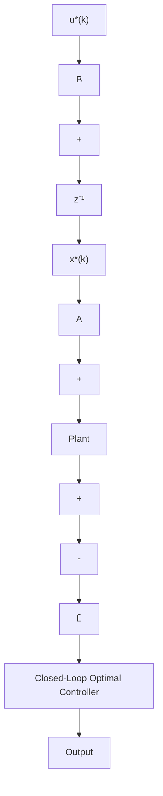

<table><tr><td colspan="2">A. Statement of the Problem</td></tr><tr><td colspan="2">Given the plant as $\mathbf{x}(k+1) = \mathbf{A}\mathbf{x}(k) + \mathbf{B}\mathbf{u}(k)$ the performance index as $J(k_0) = \frac{1}{2} \sum_{k=k_0}^{\infty} [\mathbf{x}'(k)\mathbf{Q}\mathbf{x}(k) + \mathbf{u}'(k)\mathbf{R}\mathbf{u}(k)]$ where,  $k_f = \infty$ ,find the optimal control, state and the performance index.</td></tr><tr><td colspan="2">B. Solution of the Problem</td></tr><tr><td>Step 1</td><td>Solve the matrix algebraic Riccati equation $\bar{\mathbf{P}} = \mathbf{A}'\bar{\mathbf{P}} [\mathbf{I} + \mathbf{B}\mathbf{R}^{-1}\mathbf{B}'\bar{\mathbf{P}}]^{-1} \mathbf{A} + \mathbf{Q}$ , or $\bar{\mathbf{P}} = \mathbf{A}'\{\bar{\mathbf{P}} - \bar{\mathbf{P}}\mathbf{B} [\mathbf{B}'\bar{\mathbf{P}}\mathbf{B} + \mathbf{R}]^{-1} \mathbf{B}'\bar{\mathbf{P}}\} \mathbf{A} + \mathbf{Q}.$ </td></tr><tr><td>Step 2</td><td>Solve the optimal state  $\mathbf{x}^{*}(k)$  from $\mathbf{x}^{*}(k+1) = [\mathbf{A} - \mathbf{B}\bar{\mathbf{L}}] \mathbf{x}^{*}(k)$  or $\mathbf{x}^{*}(k+1) = [\mathbf{A} - \mathbf{B}\bar{\mathbf{L}}_{a}] \mathbf{x}^{*}(k).$ with initial condition  $\mathbf{x}(k_0) = \mathbf{x}_0$ , where $\bar{\mathbf{L}} = \mathbf{R}^{-1}\mathbf{B}'\mathbf{A}^{-T} [\bar{\mathbf{P}} - \mathbf{Q}]$  and $\bar{\mathbf{L}}_{a} = [\mathbf{B}'\bar{\mathbf{P}}\mathbf{B} + \mathbf{R}]^{-1} \mathbf{B}'\bar{\mathbf{P}}\mathbf{A}.$ </td></tr><tr><td>Step 3</td><td>Obtain the optimal control  $\mathbf{u}^{*}(k)$  from $\mathbf{u}^{*}(k) = -\bar{\mathbf{L}}\mathbf{x}^{*}(k)$ , or $\mathbf{u}^{*}(k) = -\bar{\mathbf{L}}_{a}\mathbf{x}^{*}(k).$ </td></tr><tr><td>Step 4</td><td>Obtain the optimal performance index from $J^{*}(k_0) = \frac{1}{2}\mathbf{x}^{*\prime}(k)\bar{\mathbf{P}}\mathbf{x}^{*}(k).$ </td></tr></table>

The optimal cost function (5.3.29) becomes

$$\boxed {J ^ {*} (k) = \mathbf {x} ^ {* \prime} (k) \bar {\mathbf {P}} \mathbf {x} ^ {*} (k).} \tag {5.4.11}$$

The entire procedure is now summarized in Table 5.4. The implementation of this closed-loop optimal control for steady-state $(k_{f} \rightarrow \infty)$ case is shown in Figure 5.6. We now illustrate the previous procedure by considering the same system of Example 5.3.

flowchart

Figure 5.6 Closed-Loop Optimal Control for Discrete-Time Steady-State Regulator System
