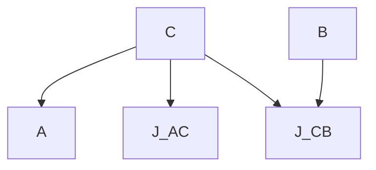

# 6.3.1 Principle of Optimality

Consider a simple multistage decision optimization process shown in Figure 6.3. Here, let the optimizing cost function for the segment AC

flowchart

Figure 6.3 Optimal Path from A to B

be $J_{AC}$ and for the segment CB be $J_{CB}$ . Then the optimizing cost for the entire segment AB is

$$J _ {A B} = J _ {A C} + J _ {C B}. \tag {6.3.1}$$

That is, if $J_{AC}$ is the optimal cost of the segment AC of the entire optimal path AB, then $J_{CB}$ is the optimal cost of the remaining segment CB. In other words, one can break the total optimal path into smaller segments which are themselves optimal. Conversely, if one finds the optimal values for these smaller segments, then one can obtain the optimal value for the entire path. This obvious looking property is called the principle of optimality (PO) and stated as follows [79]:

An optimal policy has the property that whatever the previous state and decision (i.e., control), the remaining decisions must constitute an optimal policy with regard to the state resulting from the previous decision.
