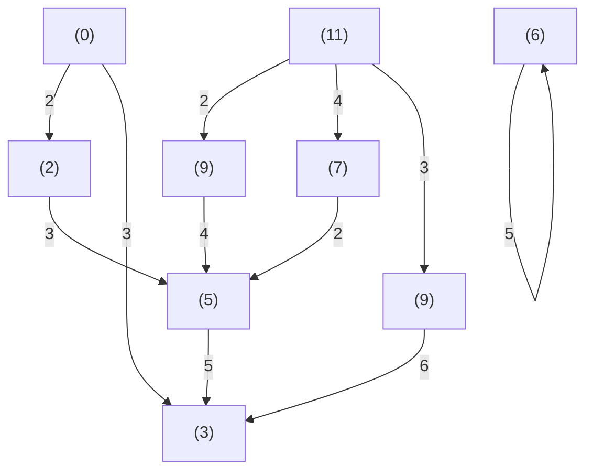

# Backward Solution

It looks natural to start working backward from the final stage or point, although one can also work forward from the initial stage or point. To illustrate the principle of optimality, let us consider a multistage decision process as shown in Figure 6.4. This may represent an aircraft routing

text_image

E
5 4
C 4 H
2 3 2
A F B
4 2 5 3
D I
3 6
G

Figure 6.4 A Multistage Decision Process

network or a simple message (telephone) network system. In an aircraft routing system, both the initial point A and the final point B represent the two cities to be connected and the other nodes C, D, E, F, G, H, I represent the intermediate cities. The numbers (called units) over each segment indicate the cost (or performance index) of flying between the two cities. Now we are interested in finding the most economical route to fly from city A to city B. We have 5 stages starting from k = 0 to k = N = 4. Also, we can associate the current state as the junction or the node. The decision is made at each state. Let the decision or control be $u = \pm 1$ , where $u = +1$ indicates move up or left and $u = -1$ indicates move down or right looking from each junction towards right.

Now, our working of the dynamic programming algorithm is shown in Figure 6.5.

flowchart

Figure 6.5 A Multistage Decision Process: Backward Solution

Stage 5: $k = k_{f} = N = 4$

This is just the starting point, there is only one city $B$ and hence there is no cost involved.

Stage 4: $k = 3$

There are two cities H and I at this stage and we need to find the most economical route from this stage to stage 5. Working backward, we begin with B which can be reached by H or I. It takes 2 units to fly from H to B by using control or decision u = -1 (downward or right) and hence let us place the number 2 within parenthesis under

H. Similarly, it takes 3 units to fly from I to B by using control or decision $u = +1$ (upward or left) and hence place the number 3 just near to I. Let us also place an arrow head to the corresponding paths or routes. Note there is no other way of flying from H to B and I to B except as shown by the arrows.
