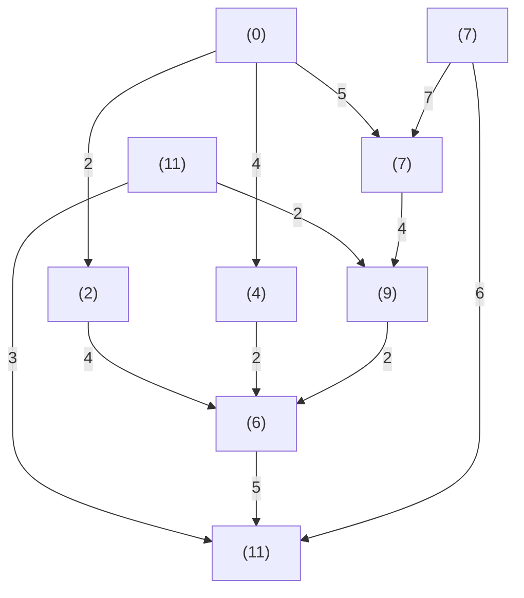

# Forward Solution

One can solve the previous system using forward solution, starting from A at stage 0 and working forward to stages 1, 2, 3 and finally to stage 5 to reach B. We do get the identical result as in backward solution as shown in Figure 6.6.

flowchart

Figure 6.6 A Multistage Decision Process: Forward Solution

Thus, as shown in both the previous cases, we

1. divide the entire route into several stages,   
2. find the optimal (economical) route for each stage, and   
3. finally, using the principle of optimality, we are able to combine the different optimal segments into one single optimal route (or trajectory).

In the previous cases, we have fixed both the initial and final points and thus we have a fixed-end-point system. We can similarly address the variable end point system.

Next, we explore how the principle of optimality in the dynamic programming can be used to optimal control systems. We notice that the dynamic programming approach is naturally a discrete-time system. Also, it can be easily applied to either linear or nonlinear systems, whereas the optimal control of a nonlinear system using Pontryagin principle leads to nonlinear two-point boundary value problem (TP-BVP) which is usually very difficult to solve for optimal solutions.
