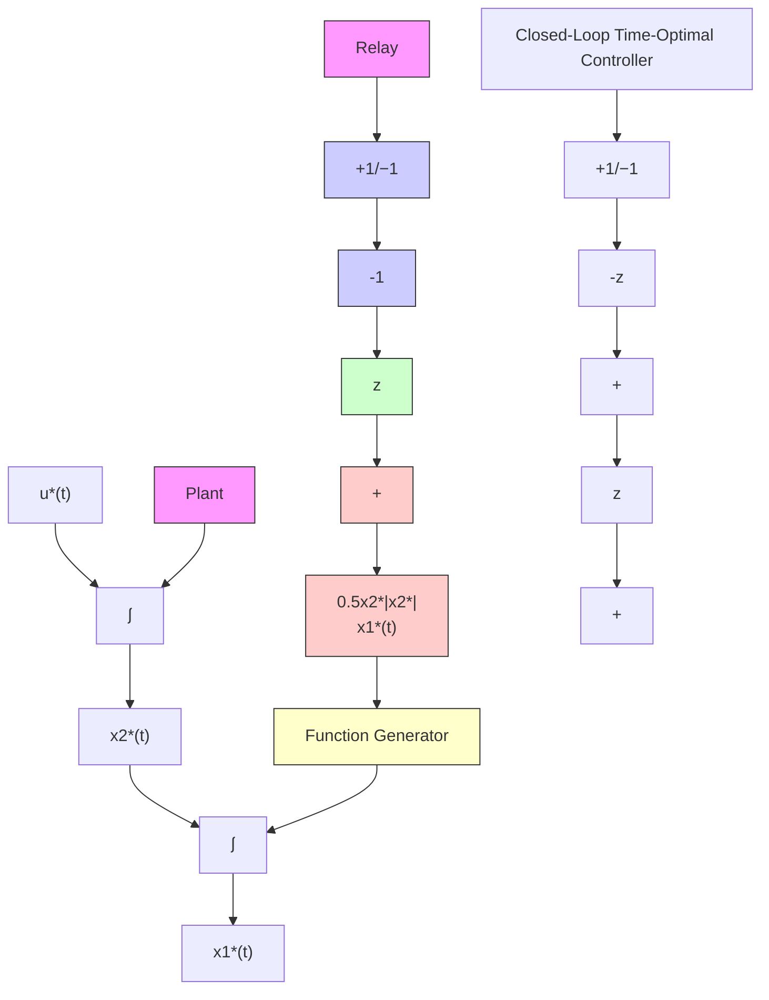

# 7.2.3 Engineering Implementation of Control Law

Figure 7.11 shows the implementation of the optimal control law (7.2.26).

1. If the system is initially at $(x_{1}, x_{2}) \in R_{-}$ , then $x_{1} > -\frac{1}{2} x_{2}|x_{2}|$ , which means $z > 0$ and hence the output of the relay is $u^{*} = -1$ .

2. On the other hand, if the system is initially at $(x_{1}, x_{2}) \in R_{+}$ , then $x_{1} < -\frac{1}{2}x_{2}|x_{2}|$ , which means z < 0 and hence the output of the relay is $u^{*} = +1$ .

flowchart

Figure 7.11 Closed-Loop Implementation of Time-Optimal Control Law

Let us note that the closed-loop (feedback) optimal controller is non-linear (control $u^{*}$ is a nonlinear function of $x_{1}^{*}$ and $x_{2}^{*}$ ) although the system is linear. On the other hand, we found in Chapters 3 and 4 for unconstrained control, the optimal control $u^{*}$ is a linear function of the state $x^{*}$ .
