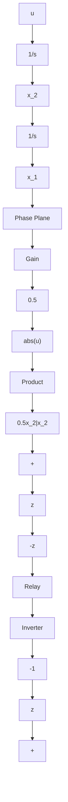

# 7.3 Fuel-Optimal Control Systems

Fuel-optimal control systems arise often in aerospace systems where the vehicles are controlled by thrusts and torques. These inputs like thrusts are due to the burning of fuel or expulsion of mass. Hence, the natural question is weather we can control the vehicle to minimize the fuel consumption. Another source of fuel-optimal control systems is nuclear reactor control systems where fuel remains within the system and not expelled out of the system like in aerospace systems.

flowchart

Figure 7.12 SIMULINK $^{©}$ Implementation of Time-Optimal Control Law

An interesting historical account is found in $[59]$ regarding fuel-optimal control as applicable to the terminal phase of the lunar landing problem $[100]$ of Apollo 11 mission, in which astronauts Neil Armstrong and Edwin Aldrin soft-landed the Lunar Excursion Module (LEM) “Eagle” on the lunar surface on July 20, 1969, while astronaut Michael Collins was in the orbit with Apollo Command Module “Columbia”.
