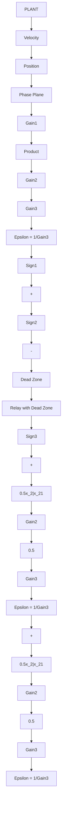

# 7.5 Energy-Optimal Control Systems

In minimum-energy (energy-optimal) systems with constraints, we often formulate the performance measure as the energy of an electrical (or mechanical) system. For example, if $u(t)$ is the voltage input to a field circuit in a typical constant armature-current, field controlled positional control system, with negligible field inductance and a unit field resistance, the total energy to the field circuit is (power is $u^{2}(t)/R_{f}$ , where, $R_{f}=1$ is the field resistance)

$$J = \int_ {t _ {0}} ^ {t _ {f}} u ^ {2} (t) d t \tag {7.5.1}$$

and the field voltage $u(t)$ is constrained by $|u(t)| \leq 110$ . This section is based on [6, 89].

flowchart

Figure 7.29 SIMULINK $^{©}$ Implementation of Fuel-Optimal Control Law
