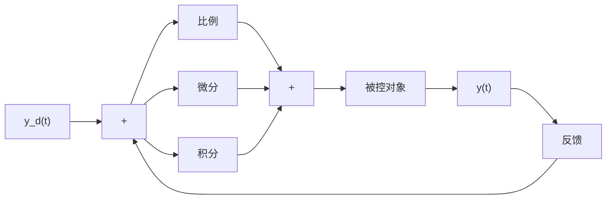

# 1.1 PID 控制原理

在模拟控制系统中，控制器最常用的控制规律是 PID 控制。模拟 PID 控制系统原理框图如图 1-1 所示。系统由模拟 PID 控制器和被控对象组成。

flowchart

图 1-1 模拟 PID 控制系统原理框图

PID 控制器是一种线性控制器，它根据给定值 $y_{\mathrm{d}}(t)$ 与实际输出值 $y(t)$ 构成控制偏差

$$\operatorname{error} (t) = y _ {\mathrm{d}} (t) - y (t) \tag {1.1}$$

PID 的控制规律为

$$u (t) = k _ {\mathrm{p}} \left[ \mathrm{error} (t) + \frac {1}{T _ {\mathrm{I}}} \int_ {0} ^ {t} \mathrm{error} (t) \mathrm{d} t + \frac {T _ {\mathrm{D}} \mathrm{derror} (t)}{\mathrm{d} t} \right] \tag {1.2}$$

或写成传递函数的形式

$$G (s) = \frac {U (s)}{E (s)} = k _ {\mathrm{p}} \left(1 + \frac {1}{T _ {\mathrm{I}} s} + T _ {\mathrm{D}} s\right) \tag {1.3}$$

式中， $k_{p}$ 为比例系数； $T_{I}$ 为积分时间常数； $T_{D}$ 为微分时间常数。

简单说来，PID 控制器各校正环节的作用如下：

（1）比例环节：成比例地反映控制系统的偏差信号 $error(t)$ ，偏差一旦产生，控制器立即产生控制作用，以减少偏差。  
（2）积分环节：主要用于消除静差，提高系统的无差度。积分作用的强弱取决于积分时间常数 $T_{1}$ ， $T_{1}$ 越大，积分作用越弱，反之则越强。  
（3）微分环节：反映偏差信号的变化趋势（变化速率），并能在偏差信号变得太大之前，在系统中引入一个有效的早期修正信号，从而加快系统的动作速度，减少调节时间。

