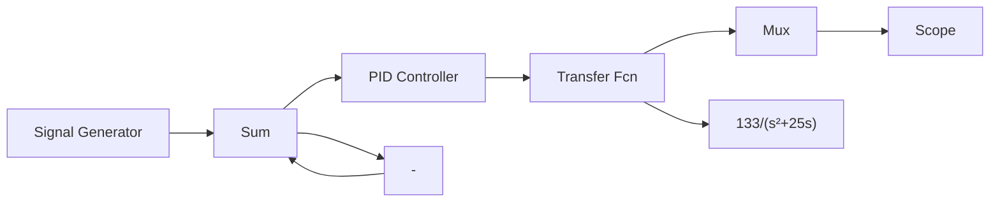
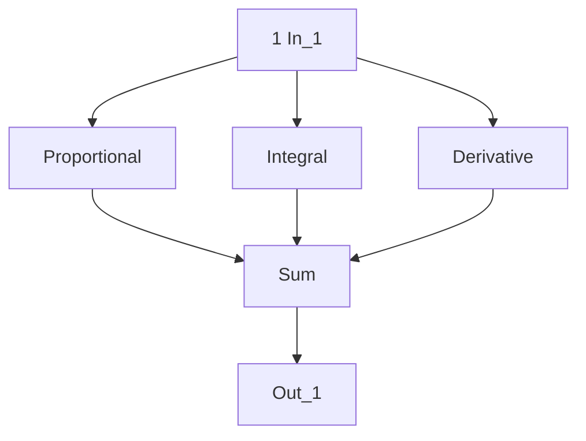

# 【仿真之一】连续系统 PID 的 Simulink 仿真

PID 控制器由 Simulink 下的工具箱提供。

Simulink 仿真程序: chap1\_1.mdl

flowchart

上述 PID 控制器采用 Simulink 封装的形式，其内部结构如下：

flowchart

连续系统的模拟 PID 控制正弦响应结果如图 1-2 所示。

line

| Time offset | Value |
| --- | --- |
| 0 | 0 |
| 1 | 1 |
| 2 | 0 |
| 3 | -1 |
| 4 | -2 |
| 5 | -1 |
| 6 | 0 |
| 7 | 1 |
| 8 | 0 |
| 9 | -1 |
| 10 | 0 |

图 1-2 连续系统的模拟 PID 控制正弦响应
